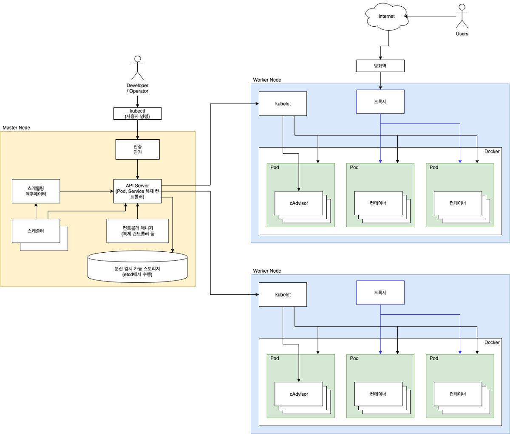

### 쿠버네티스 전체 구조
- 마스터와 노드 구조
- 보통 마스터는 3, 5대로 홀수로 구성
- 평소에는 리더 마스터 1대만 운영하고, 리더 마스터 장애 시 다른 마스터가 리더가 됨

### 마스터 노드 통신 구조

- 마스터
  - kube-apiserver를 중심으로 모든 통신이 이루어짐
  - etcd에는 kube-apiserver만 접근이 가능
  - 마스터에서는 kubelet이 도커를 관리
  - 마스터의 도커 내부에는 kube-scheduler, kube-controller-manager, kube-api-server, kube-proxy가 동작하고 있음
  - 그 외에 마스터에서는 etcd가 별도의 프로세스로 동작할 수도 있고, 도커 내부에서 동작할 수도 있음.
- 노드
  - kubelet으로 도커를 관리
  - 노드의 kubelet은 마스터의 kube-apiserver와 통신하며 파드의 생성, 관리, 삭제를 담당
  - 노드의 kube-proxy는 마스터와 달리 컨테이너가 아니라 서버 프로세스로 실행 가능

### 쿠버네티스 주요 컴포넌트
- 마스터용 컴포넌트: etcd, kube-apiserver, kube-scheduler, kube-controller-manager, cloud-controller-manater
- 노드용 컴포넌트: kubelet, kube-proxy, container-runtime
- 애드온 컴포넌트: networking-addon, dns-addon, dashboard-addon, resource-monitoring-addon

### 마스터용 컴포넌트
- etcd
  - key-value 저장소로 쿠버네티스에서의 데이터베이스 역할 수행
  - 노드 사이의 상태를 공유하는 합의 알고리즘은 raft를 구현한 것
  - 서버 하나당 프로세스 1개만 사용이 가능
  - etcd 자체도 클러스터로 구축이 가능
- kube-apiserver
  - 클러스터의 API를 사용할 수 있도록 하는 컴포넌트
  - 쿠버네티스에 보내는 모든 요청은 kube-apiserver를 이용해서 다른 컴포넌트로 전달
  - scaleout이 가능하여 여러대의 서버에서 여러 개의 kube-apiserver를 실행할 수 있음
- kube-scheduler
  - 현재 클러스터 안에서 자원 할당이 가능한 노드 중 알맞은 노드를 선택
  - 파드 실행시 조건에 맞는 노드를 찾는 역할
- kube-controller-manager
  - 쿠버네티스에서는 파드를 관리하는 컨트롤러가 있다.
  - 컨트롤러들은 논리적으로는 개별 프로세스이지만, 복잡도를 줄이기 위해 하나의 바이너리로 컴파일해서 단일 프로세스로 실행시킨다.
  - 컨트롤러 매니저란 컨트롤러 각각을 실행하는 컴포넌트
  - 컨트롤러 구조체를 큐 형식으로 관리하는 방식으로 동작
- cloud-controller-manager
  - 쿠버네티스 컨트롤러들을 클라우드 서비스와 연결해 관리하는 컴포넌트
  - 네 가지 컨트롤러 컴포넌트를 관리
    - node controller: 클라우드 서비스 안의 노드를 관리
    - route controller: 클라우드 서비스 안의 네트워크 라우팅 관리
    - service controller: 클라우드 서비스에서 제공하는 로드 밸런서 생성, 갱신, 삭제 등에 사용
    - volume controller: 클라우드 서비스에서 생성한 볼륨을 노드에 연결 및 마운트

### 노드용 컴포넌트
- kubelet
  - 클러스터 안 모든 노드에서 실행되는 에이전트
  - 파드 컨테이너들의 실행을 직접 관리
  - 파드스펙이라는 조건이 담긴 설정을 전달 받아서 컨테이너 실행, 헬스 체크 진행
- kube-proxy
  - 클러스터 내부의 별도의 가상 네트워크를 설정하고 관리
- container-runtime
  - 컨테이너를 실행, 도커를 선택할 수도 있고 containerd나 runc 같은 런타임도 지원

### 애드온 컴포넌트
- 네트워킹 애드온
  - AWS나 GCP에서 제공하는 쿠버네티스를 사용하면 별도의 네트워킹 애드온을 제공
  - 직접 구축시에는 신경써서 설치해서 사용해야함
- DNS 애드온
  - 클러스터 안에서 동작하는 DNS 서버
  - kube-dns나 CoreDNS 등이 대표적
- 대시보드 애드온
  - 웹 UI로 쿠버네티스 사용 시에 유용
  - 클러스터 현황이나 파드 상태 한눈에 쉽게 파악이 가능
- 컨테이너 자원 모니터링
  - CPU 및 메모리 사용량 같은 데이터들을 시계열 형식으로 저장해서 볼 수 있음
  - kubelet 안에 포함된 cAdvisor라는 모니터링 도구를 사용
- 클러스터 로깅
  - 쿠버네티스 구성 요소들의 로그들을 중앙화

### 오브젝트와 컨트롤러
- 사용자는 선언적 API를 정의하여 자원의 바라는 상태를 정의
- 컨트롤러는 바라는 상태와 현재 상태가 일치하도록 오브젝트를 생성 / 삭제
- 오브젝트: 파드, 서비스, 볼륨, 네임스페이스로 구성
- 컨트롤러: 레플리카세트, 디플로이먼트, 스티이트풀세트, 데몬세트, 잡으로 구성

### 네임스페이스
- 클러스터 하나를 여러개의 논리적인 단위로 나눠서 사용하는 것
- 클러스터 하나를 여러개의 팀이나 사용자가 공유할 수 있음
- 클러스터 안에서 용도에 따라 실행해야할 앱 구분시 사용
- 네임 스페이스 별로 쿼터 설정하여 사용량 제한도 가능
- 기본 네임스페이스
  - default: 별도의 네임스페이스 지정하지 않으면 default 사용
  - kube-system: 쿠버네티스 시스템에서 관리하는 네임스페이스, 쿠버네티스 관리용 파드나 설정이 있음
  - kube-public: 클러스터 안 모든 사용자가 읽을 수 있는 네임스페이스, 클러스터 사용량 등의 정보 관리
  - kube-node-lease: 각 노드의 lease object(임대 오브젝트 관리)

### 템플릿
- 오브젝트나 컨트롤러가 어떤 상태여야 하는지를 적용할 떄 YAML 형식의 템플릿 사용
```
---
apiVersion: v1
kind: Pod
metadata:
spce:
```
- 각 항목을 필드라고 한다.
- apiVersion: 쿠버네티스 API 버전을 명시
- 템플릿에서 Pod, Deployment, Ingress 등의 다양한 오브젝트나 컨트롤러 설정이 가능
- metadata 필드에는 오브젝트의 이름이나 레이블을 설정
- spec: 파드가 어떤 컨테이너를 갖고 실행하며 실행시 어떻게 동작해야할 지 명시
