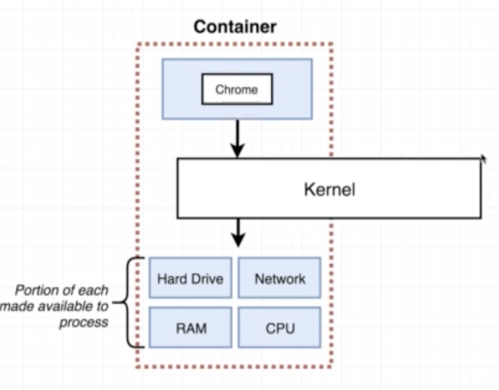

### why docker?
기존 소프트웨어 사용방법
- installer를 다운로드
- installer를 실행
- 에러가 발생
- 트러블 슈팅
- 다시 인스톨러 실행
- 다시 에러 발생!
-> 도커는 이러한 문제가 없다.
도커는 소프트웨어의 설치와 의존성 문제에 대한 해결책을 제시해준다.

### what is docker?
- docker is a platform or ecosystem around creating and running containers.
- docker image: single file with all the deps and config required to run a program.
- docker container: Instance of an image. Runs a program
  own little space, own little space of disk and so on.

### Docker
a set of platform as a service (PaaS) products that uses OS-level virtualization to deliver software in packages called containers.
(wikipedia)
docker client(docker cli): 를 제공, 이미지나 컨테이너를 직접 조작하지 않는다. docker cli를 이용해서 docker daemon을 사용하게 되는 것.
docker server(docker daemon): 컨테이너 생성, 이미지 생성 등의 도커의 기능들을 수행하는 부분

### docker run hello-world
- docker client가 명령어 수신
- docker server가 명렁어 수행
    - 로컬 환경에 실행하고자 하는 도커 이미지가 있는지 확인
    - 없을 경우 Docker Hub에서 이미지를 다운로드
    - 명령어를 다시 입력해서 다운받은 이미지의 컨테이너 생성

### what is container?
User Level의 소프트웨어는 시스템 콜을 통해서 커널의 기능을 사용. 커널을 통해서 하드웨어를 제어한다. 그런데 소프트웨어 마다 필요로하는 언어의 버전이 다르고, 하드웨어에는 하나만 깔려있다면?

- namespacing
Isolating resources per process. 여기서 자원이란 하드 드라이브, 네트워크 등등. 특정 영역의 하드드라이브는 이 프로세스를 위한 거야! 라고 지정해주는 것.
- control groups
Limit aount of resources used per process.
특정 프로세스에게 하드웨어이 자원들을 그루핑 하여 제공하는 것. 이렇게 그루핑한 하드웨어를 사용해서 프로세스를 돌리는 것이 컨테이너. 해당 프로세스는 이 리소스 그룹에 isolated 된다.

### How's docker running on your computer?
namespacing과 cgroup은 linux의 기능이다. 그렇다면 윈도우나 맥에서는 어떻게 동작하는가? linux virtual machine 위에서 linux kernel이 동작하고 이 커널 위에서 여러 프로세스를 돌린다.

