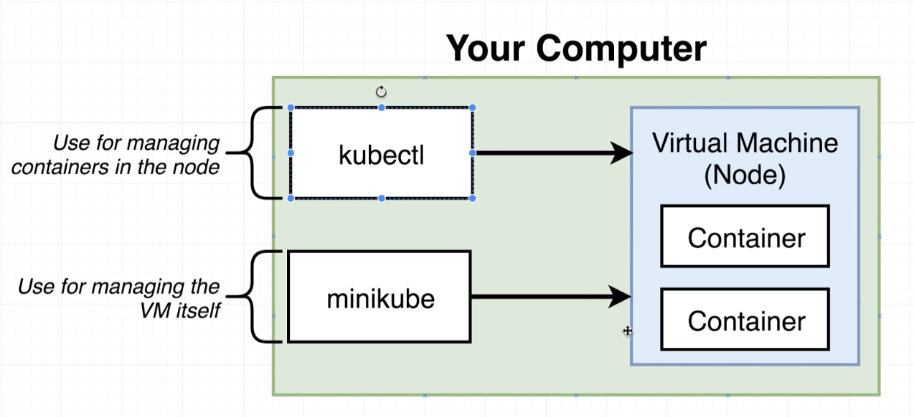

### why kubernetes?
- 이전 구조에서는 scale up에 대응하기가 어려웠다.
- 만약 트래픽이 많아진다면 worker 프로세스를 늘려주어야 하는데 이것이 어려움
- 이를 쿠버네티스를 쓰면 손쉽게 scale out 구현이 가능함
- elastic beanstalk로는 이를 구현하는 것이 어려움. 전체 Dockerrun.aws.json에 속한 시스템을 복사하는 방식
- 즉, 여러대의 머신에서 여러 대의 컨테이너를 운영하는 것을 도와주는 도구이다.

### kubernetes architecture

- 마스터 노드와 나머지 노드들이 있다.
- 그리고 각 노드들에서는 컨테이너를 띄워서 사용한다.
- 외부의 리퀘스트는 로드 밸런서를 통해서 여러 노드들에 전달된다.
- 마스터 노드는 각 노드들을 제어한다.

### kubernetes in development
- development에서는 minikube를 사용
- production에서는 EKS 혹은 GKE를 사용하거나, 직접 클러스터를 구축
- EKS, GKE를 managed solution이라 한다.

### minikube

- minikube가 해주는 일은 로컬 머신에 노드를 만들어 주는 것
- kubectl을 통해서 이 노드를 제어하게 된다.

### minikube 설치 (macOS)
- 1. brew install minikube 통해서 minikube 설치
- 2. virtualbox 설치
- 3. minikube start --driver='virtualbox' 명령어 통해서 미니큐브 시작

### kubernetes 특징
- 모든 이미지가 이미 빌드 되어 있음을 가정 -> 이미지 자체는 도커 허브에 올라가 있는다.
- 각 object 별로 한 개의 config 파일을 작성, 그러므로 config 파일이 많아지게 됨.
- 모든 네트워킹을 수동으로 설정해주어야 한다.

### kubernetes yaml 파일 분석
- kubernetes에서는 정확하게는 컨테이너가 아니라 오브젝트를 만드는 것이다.
- config yaml 파일로 오브젝트를 만들며, 오브젝트의 종류는 아래와 같다.
  - StatefulSet
  - ReplicaController
  - Pod
  - Service
```
apiVersion: v1
kind: Service
```
- kind: 내가 만들고자 하는 오브젝트의 유형을 명시한다.
- apiVersion: 내가 사용할 수 있는 오브젝트의 셋을 명시한다. 만일 apps/v1 이었다면 ControllerRevision, StatefulSet 오브젝트를 사용했을 것
- Pod은 컨테이너를 돌리기 위함
- Service는 네트워킹을 하기 위함
- 그 밖의 오브젝트들도 각기 목적이 다름

### Pod이란?
- 노드 안에 팟 안에 컨테이너를 동작
- 하나 이상의 컨테이너를 그루핑하는 것
- 쿠버네티스에서는 단순히 컨테이너를 만들어서 띄우는 것이 아니다.
- 배포할 수 있는 가장 작은 단위는 pod이다.
- pod의 목적은 비슷한 목적의 컨테이너를 그루핑 하는 것. 함께 배포되어야 하고, 함께 동작해야하는 컨테이너들을 묶은 모음

- logger와 backup-manager는 postgres 컨테이너가 꺼지면 존재 이유가 사라지게 된다. 그러므로 함께 배포되고 함께 동작해야한다. 만일 postgres 컨테이너가 꺼져도 기능할 수 있다면 같은 pod에 묶는 것이 어색하다.

```
apiversion: v1
kind: Pod
metadata:
  name: client-pod
  labels:
    component: web
spec:
  containers:
    - name: client
      image: stephengrider/multi-client
      ports:
        - containerPort: 3000
```
- Pod을 정의하는 yaml 파일
- 메타데이터와 스펙을 정의하며, 대부분 필드명에서 용도가 유추 가능하다.
- containers 아래에 ports 매핑을 해주는 부분이 있는데, 이는 해당 이미지 파일 내부에서 3000번 포트를 열어주었기 때문에 팟에서도 열어주는 것이다. 하지만 더 복잡한 네트워킹은 Service에서 정의된다.

### Service란?
- 쿠버네티스 클러스터의 네트워킹을 설정

- 쿠베 프록시를 통해서 들어온 외부 요청이 먼저 Service를 통과한다.
- Service 안에 정의된 네트워킹 설정을 통해서 내부의 Pod과 연결되게 된다.
- 서비스 자체도 여러개가 될 수 있다.
```
apiVersion: v1
kind: Service
metadata:
  name: client-node-port
spec:
  type: NodePort
  ports:
    - port: 3050
      targetPort: 3000
      nodePort: 31515
  selector:
    component: web
```
- type: service 오브젝트 아래에는 네 가지 subtype이 존재
  - ClusterIP
  - NodePort: 컨테이너의 포트를 외부에 노출, 개발용으로만 권장
  - LoadBalancer
  - Ingress

- 쿠버네티스에서 네트워킹 설정을 할 때는 label-selector 시스템이란걸 사용한다.
- 앞서 Pod을 정의할 때 metadata에서 labels: component: web으로 설정하는 부분이 있었다.
- 이를 Service에서 selector: component: web으로 받아와서 사용한다.
- 즉, 서비스와 팟은 label과 selector로 연결해준다.
- labels는 키 벨류 값으로 지정하는 것이며 굳이 component: web 이렇게 안짓고 tier:web 이렇게 지어도 된다. 쿠버네티스 component와는 상관없는 네이밍이었다.
```
  ports:
    - port: 3050
      targetPort: 3000
      nodePort: 31515
```

- port: 전체 어플리케이션 내의 다른 팟들이 multi-client pod에 접속하기 위해서 사용하는 포트
- targetPort: Service에서 pod으로 접속할 때 사용하는 포트
- nodePort: 가장 신경써야할 부분. 30000-32767 사이로 설정. 외부로 공개되는 포트. 만일 지정해주지 않으면 저 사이 랜덤 값으로 설정됨
- 이러한 특징 떄문에 NodePort 서비스는 실제 프러덕션에서는 사용하지 않는다.

### kubectl commands
```
$ kubectl apply -f <filename>
$ kubectl get pods
$ kubectl get services
```
- 기존 configure를 변경한다는 의미

### 쿠베로 띄운 클러스터 접속하기
- localhost로 접속하면 안됨
- minikube vm ip를 알아내서 nodePort로 접속하면 볼 수 있음
```
$ minikube ip
```

### kubernetes deploy detail


