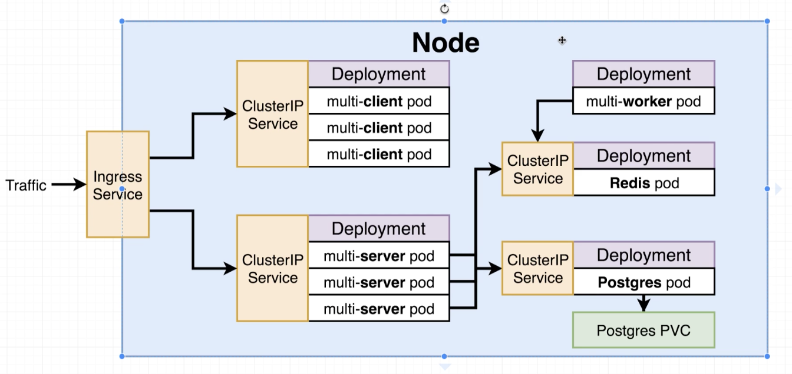

### 전체 아키텍쳐

- Ingress Service를 통해서 외부 요청을 수신
- 각각의 팟은 Cluster IP Service로 IP를 할당 받는다.
- 개발 환경에서는 하나의 노드로 구현
- 클라우드 배포 환경에서는 노드도 여러개로 나눔
- nginx proxy가 하던 역할을 ingress가 대신해주게 된다.

### ClusterIPService
- Service object type 아래에는 subtypes들이 있었다.
- ClusterIP, NodePort, LoadBalancer, Ingress가 그것이다.
- NodePort는 Pod을 외부에 노출시켰지만, ClusterIP는 더 엄격하다.
- ClusterIP는 외부에서 접속을 차단하며, ClusterIP가 가리키고 있는 클러스너 내부 자원에서만 접속이 가능하다.
- 외부에서 들어오는 트래픽은 Ingress를 통해서 ClusterIP로 전달된다.

### ClusterIPConfig
- 각 오브젝트마다 config 파일을 만드는 것이 아니라, ClusterIP와 Deployment를 묶어서 하나의 config 파일로 만들 수 있다.
- 하나의 파일에 ---로 구분하여 여러 컨피그 파일의 내용을 하나의 파일에 담을 수 있다.
- 이는 ClusterIP와 Deployment처럼 서로 관련성이 매우 높고 함께 배포되어야 하는 오브젝트만 묶어주도록 한다.

### PVC
- persistent volumn claim의 약자
- 컨테이너에 포스트그래스를 띄우게 되면 이는 컨테이너 안에다가 데이터를 쓰게 되며, 이는 컨테이너가 꺼지면 소실된다.
- 그러므로 데이터를 영구적으로 보관하기 위해서는 컨테이너 외부에 데이터를 저장해야 한다.

### kubernetes volumes
- 컨테이너에서 Volumne이란 컨테이너 외부의 파일 시스템을 사용하는 것
- kubernetes에서 Volumn이란 컨테이너가 pod level에 데이터를 저장하는 것을 허용하는 것
- 즉, 컨테이너 내부의 파일 시스템을 사용하는 것이 아니라, Pod 안의 파일 시스템을 사용하는 것을 지칭한다.
- persistent volumn claim, persistent volumn, volumn 세가지 종류가 있다.
- Pod 자체가 꺼지면 그냥 Volume으로 설정 시에는 데이터가 유실된다.
- Persistent Volume의 경우 아예 Pod 외부에 유실될 염려가 없는 파일 시스템을 생성하게 된다. 그러므로 컨테이너가 꺼지건 Pod이 꺼지건 데이터 유실의 염려가 없다.

### PVC vs PV
- bill board, computer store, factory가 있다.
- bill board에 있는 옵션들 가운데 computer store에 이미 마련되어 있는 것들이 있고, factory에서 제조해야하는 것이 있다.
- Persistent Volume Claim은 bill board이다.
- Pod Config는 먼저 PCV를 보고 가능한 옵션을 확인한다.
- Computer Store 안의 Sales Person이 Kubernetes이고, 재고는 통계적으로 프로비져닝 된 Persistent Volumne이다.
- 만일 재고에 맞는 리소스가 없다면 Dynamically provisioned persistent volume에서 요구 사항에 맞는 리소스를 가져온다.

### PersistentVolumeClaim
```
apiVersion: v1
kind: PersistentVolumeClaim
metadata:
  name: database-persistent-volume-PersistentVolumeClaim
spec:
  accessModes:
    - ReadWriteOnce
  resources:
    requests:
      storage: 2Gi
```
- PVC는 광고판이므로 실제로 가지고 있는 리소스가 아니다.
- Pod Config는 이 Volume Claim을 가지고 쿠버네티스에 리소스를 요청하는 것이다.
- accessModes
  - ReadWriteOnce: 노드 하나에서 사용됨
  - ReadOnlyMany: 여러 노드가 읽을 수 있음
  - ReadWriteMany: 많은 노드들에서 읽고 쓸 수 있음

### Persistent Volume
- 내 로컬 환경에서 쿠버네티스가 스토리지 할당을 요청받으면 결국 내 하드드라이브의 공간을 할당해주는 것
- 만일 클라우드 환경에서 쿠버네티스를 운영한다면 쿠버네티스는 디스크 공간을 선택할 수 있는 선택지가 늘어난다.
  - GCP Persistent Disk
  - Azure File
  - Azure Disk
  - AWS Block Store

### 환경 변수 설정 및 데이터 베이스 연결
- worker pod과 server pod에서 redis pod과 postgres pod에 접속할 수 있어야 하며, 이 때 각각의 ClusterIP Service를 통과해야한다.
- cluster ip service의 이름을 통해서 접속이 가능하다.
- 쿠버네티스 클러스터 내에서 ClusterIPService의 이름을 호스트 명으로 사용한다.

### Secrets Service
- API 키, DB 비밀번호와 같은 민감한 정보들을 담을 수 있는 서비스
- 이 부분은 imperative하게 진행할 수 밖에 없다.
```
$ kubectl create secret generic <secret_name> --from-literal
```
