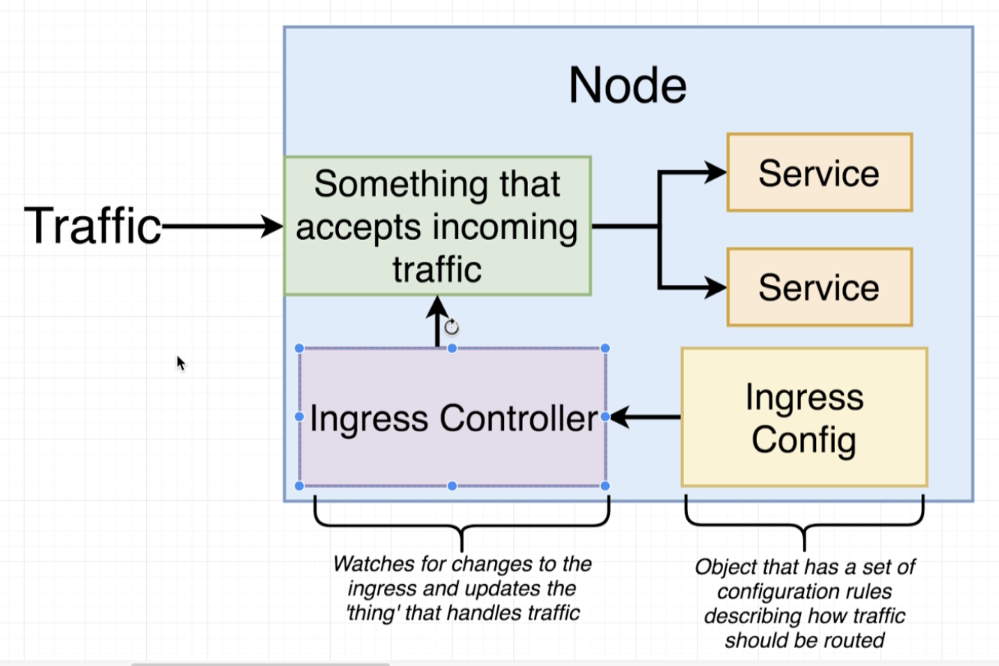
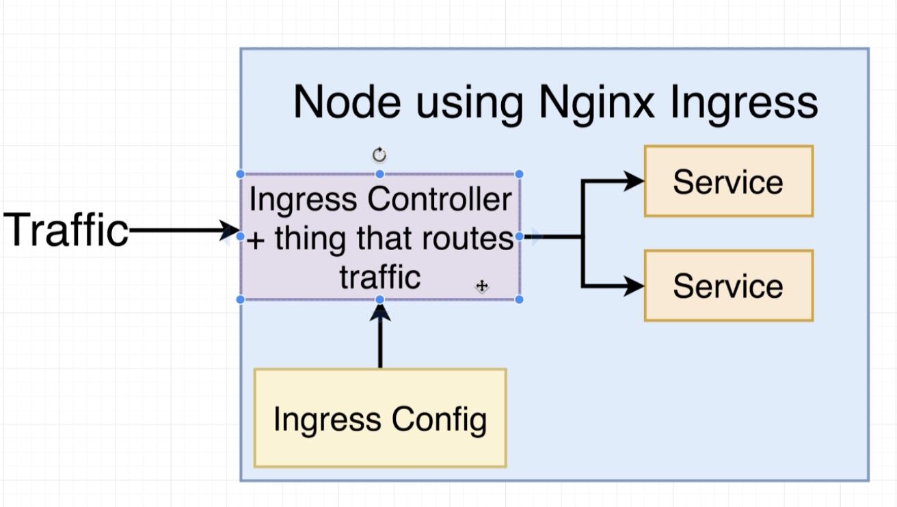

### Load Balancer
- Service의 subtype
- 일종의 Legacy로 외부 트래픽을 클러스터에 전달해주는 역할을 한다.
- 특정 pod에 외부 트래픽을 전달해주는 역할을 하는 서비스
- 따라서 여러개의 팟을 외부에 노출시키고 싶다고 한다면 적절하지 못하다.
- 클라우드 서비스를 이용할 때에는 별도의 Load Balancer 서비스가 있고 이를 클러스터 내부로 연결하기 위해서 만들어진 서비스이다.

### Ingress
- ingress-nginx라는 프로젝트가 있고, 커뮤니티 주도로 만든 프로젝트다.
- kubernetes-ingress라는 프로젝트가 있고, nginx 회사가 주도로 만든 프로젝트이다.
- 두 개의 프로젝트 모두 nginx를 기반으로 한다.
- 두 개의 프로젝트는 완전히 별개로 kubernetes/ingress-nginx 프로젝트를 사용한다는 점에 주의하라
- ingress의 셋업은 GCP, AWS, Azure를 쓰느냐에 따라서 살짝씩 달라진다.

### Ingress Controller
- 우리가 원하는 상태로 오브젝트들을 맞춰주는 것을 쿠버네티스에서는 Controller라고 한다.
- 외부에서 들어으는 트래픽을 수신하여 라우팅해주도록 Ingress 오브젝트의 상태를 맞춰주는 config file을 작성한다.
- kubectl은 Ingress Controller를 생성해서 우리가 원하는 상태로 동작하도록 routing을 해주는 nginx가 동작하는 Pod을 띄워준다.

