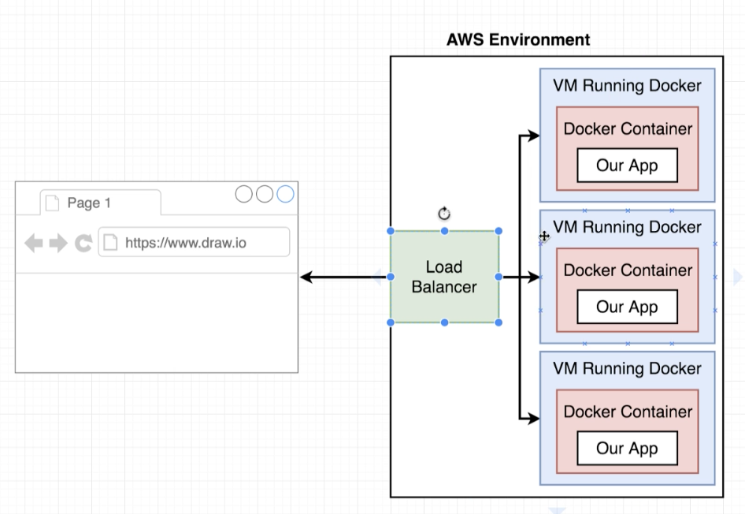

### Travis CI set up
- 프러덕션 컨테이너는 테스트 코드 실행이 불가
- 그러므로 트레비스에서 테스트용 컨테이너 빌드하고 테스트 진행
```
sudo: required
services:
    - docker

before_install:
    - docker build -t yeomko/docker-react -f Dockerfile.dev .

script:
    - docker run -e CI=true yeomko/docker-react npm run test
```
- npm 테스트를 실행하고 자동으로 exit 되도록 설정하는 부분
```
$ docker run -e CI=true yeomko/docker-react npm run test
```

### AWS beanstalk
- 컨테이너 하나로 이루어진 서비스 배포하기에 편리한 도구
- 자동으로 로드 밸런서를 설정해주며, 로드 밸런서와 도커 컨테이너를 연결해준다.
- 트래픽이 증가하면 자동으로 컨테이너의 수를 늘려주는 것 까지 지원한다.


### AWS IAM
- 외부 서비스에서 AWS 내부의 서비스들을 이용하기 위한 API 키들을 관리해주는 서비스
- 1. 유저 생성
- 2. 기존 정책에서 직접 권한 추가
    - beanstalk 권한 추가
- 3. ACCESS KEY와 SECRET KEY 생성
- 4. travis 콘솔에서 환경변수로 추가해줌

### beanstalk 포트 매핑
- dockerfile을 beanstalk에 배포할 시에 반드시 EXPOSE를 포함해서 포트 매핑을 해주어야함.
- beanstalk는 dockerfile을 스캔해서 EXPOSE가 되어있는 포트에 자동으로 매핑을 해줌.

### travis.yml에 deploy 추가
```
sudo: required
services:
    - docker

before_install:
    - docker build -t yeomko/docker-react -f Dockerfile.dev .

script:
    - docker run -e CI=true yeomko/docker-react npm run test

deploy:
    provider: elasticbeanstalk
    access_key_id: $AWS_ACCESS_KEY
    secret_access_key: $AWS_SECRET_KEY
    region: "ap-northeast-2"
    app: "docker"
    env: "Docker-env"
    bucket_name: "elasticbeanstalk-ap-northeast-2-889246185872" 
    on:
        branch: master
```
