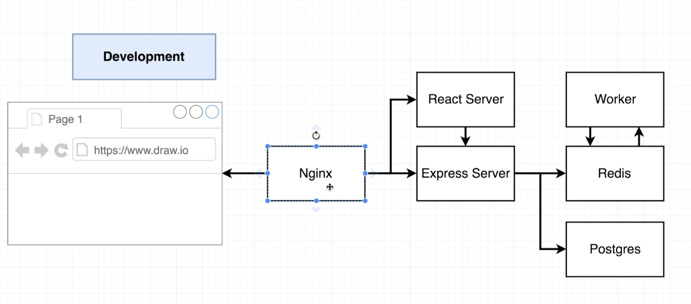

### nodejs에서 redis subscribe하기

```
sub.on('message', (channel, message) => {
    redisClient.hset('values', message, fib(parseInd(message)));
});

sub.subscribe('insert');
```
nodejs의 redis 라이브러리에서 간단한 설정만으로 redis에 insert 이벤트를 감지해서 작동하는 워크를 구현할 수 있다.

### environment variables from docker compose
```
variableName=value
```
위 명령어는 컨테이너의 런타임에 지정한 값으로 환경 변수를 주입하는 것
```
variableName
```
위 명령어는 컨테이너의 런타임에 내 로컬 컴퓨터의 환경변수를 꺼내가는 것

### docker-compose port mapping
- 도커 컴포즈로 엮은 컨테이너끼리는 별도의 포트 노출 없이도 접속이 가능하다.
- 포트 노출을 하지 않고 외부와 통하는 nginx를 통해서만 서비스를 이용 가능하게 구성할 수 있다.

- nginx 프록시가 api로 들어가는 url과 react frontend로 들어가는 url을 나누어준다.
- 또한 url마다 포트 번호를 붙여줘야하는 수고로움을 덜어주며, 포트가 변경될 경우 발생할 수 있는 에러를 예방한다.


### nginx conf 수정하기
- nginx는 외부에서 오는 요청을 수신하여 뒷 단의 React Server와 Express Server에 전달해준다.
- 이를 upstream server라 하며 이들에게 nginx가 트래픽을 redirect 해주는 것이다.
- location 명령어로 프록시를 설정해준다.
- rewrite 명령어로 /api/values와 같은 url을 프록시를 통과하면 /values로 정리하도록 설정한다.
```
upstream client {
  server client:3000;
}

upstream api {
  server api:5000;
}

server {
  listen 80;
  location / {
    proxy_pass http://client;
  }
  location /api {
    rewrite /api/(.*) /$1 break;
    proxy_pass http://api;
  }
}
```
