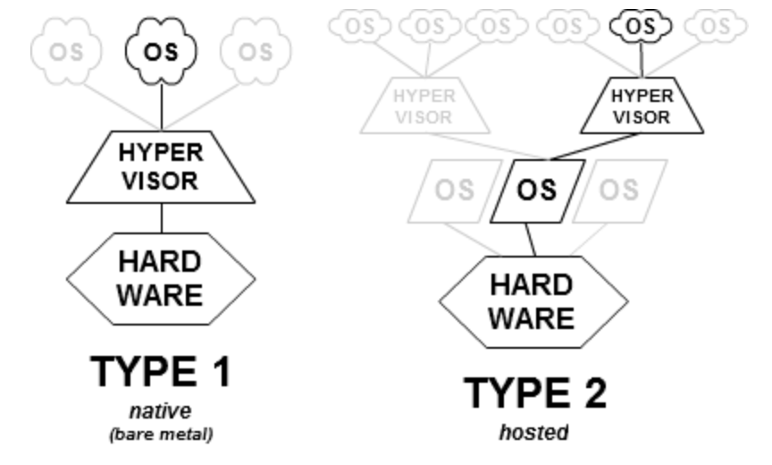
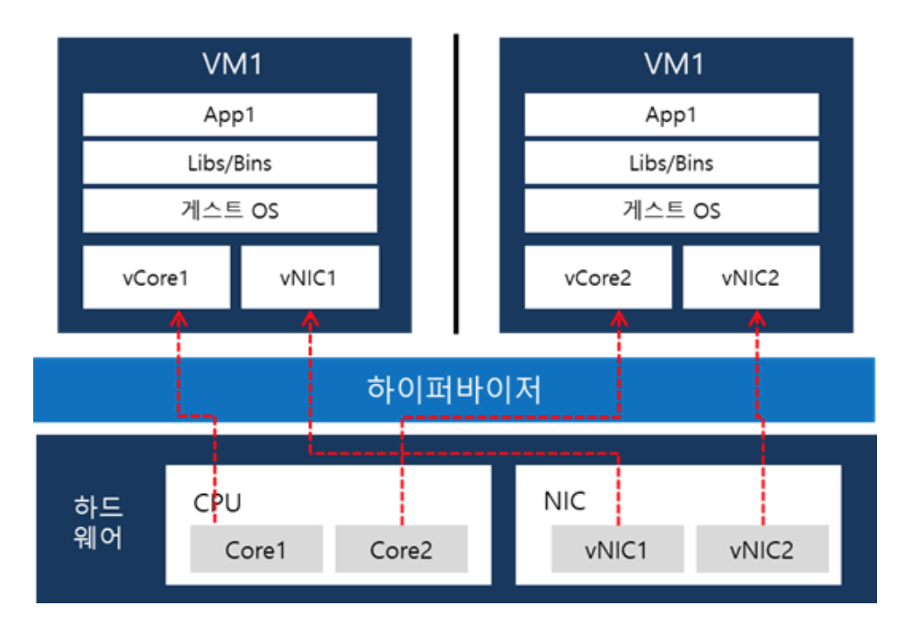
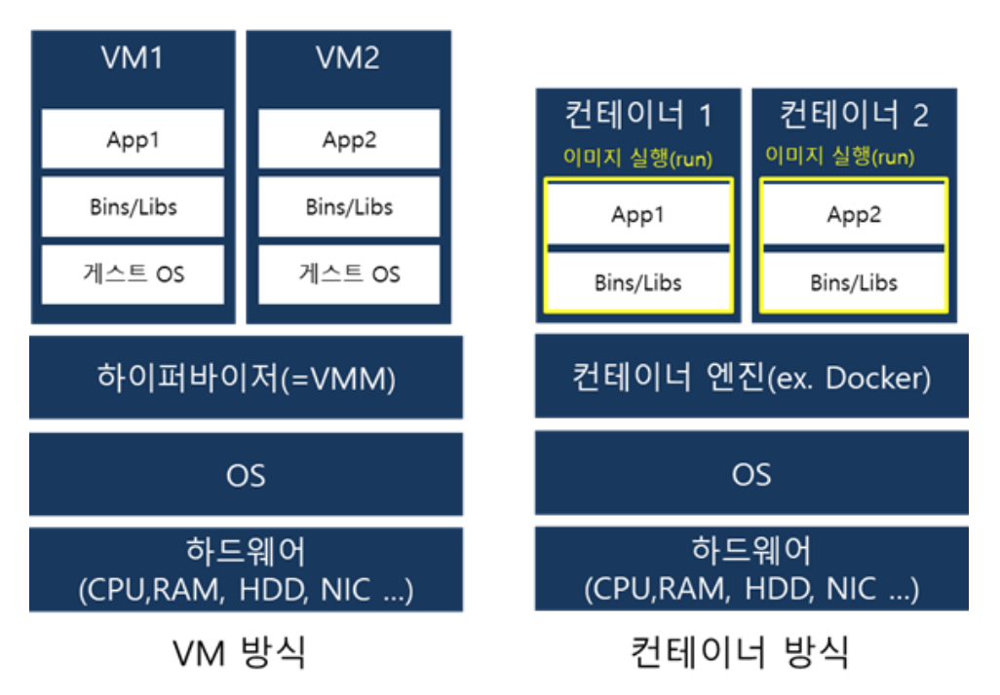

1. Hypervisor를 설명하시오
- 호스트 컴퓨터에서 다수의 운영 체제를 동시에 실행하기 위한 논리적 플랫폼을 말한다. 두 가지 타입으로 나뉜다.

- type1은 하이퍼바이저가 해당 하드웨어에서 직접 실행되며 게스트 운영 체제는 하드웨어 위에서 2번째 수준으로 실행된다. MS의 hyper-V가 대표적이다. type1 가상화는 다시 전가상화와 반가상화로 나뉜다.
  - 전가상화는 게스트 OS를 호스트 시스템과 완전히 분리하여 실행. 게스트 OS는 하드웨어 자원을 요청하기 위해 dom 0라는 가상머신을 통해야 함.
  - 반가상화 방식은 게스트 OS를 일부 수정하여 필요한 하드웨어 자원을 직접 요구할 수 있음.
- type2는 일반 프로그램과 같이 호스트 운영체제에서 실행되며 VM 내부에서 동작되는 게스트 운영체제는 하드웨어에서 3번째 수준으로 실행된다. VMWare, Virtual Box가 대표적이다. 

- VM별로 독립된 가상의 자원을 할당 받는다. VM은 논리적으로 분리되어 있다.

2. Virtualization이란?
- 소프트웨어 기반의 가상의 것을 만들어 내는 것으로 하드웨어 플랫폼, 저장 장치, 네트워크 리소스 등이 포함된다.

3. Hardware-level virtualization
- 하나의 호스트 위에 여러 운영체제를 돌리기 위해서 하드웨어 수준에서 가상화를 적용하는 것. Hypervisor가 대표적이며 이를 이용해서 만들어낸 인스턴스를 VM이라 부른다.

3. OS-level virtualization
- OS 레벨 가상화란 OS 커널이 여러개의 격리된 user space instance를 허용하는 OS 패러다임을 가리킨다. 그리고 이 인스턴스를 컨테이너라고 부른다. 컨테이너들은 호스트 OS의 커널 단을 공유합니다.

4. VM과 컨테이너의 공통점과 차이점
- 공통점: 둘 다 가상화 기술이 적용된 결과물이다.
- 차이점: 어떤 시스템 레벨을 가상화 하는지가 차이가 난다.

- VM 방식은 호스트 OS 위에 하이퍼바이저를 통해서 하드웨어를 가상화 시킨 다음, 게스트 OS 자체를 올린다.
- 반면 컨테이너 방식은 호스트 OS 위에 컨테이너 엔진을 놓고, 그 위에 컨테이너를 실행시킨다. 게스트 OS를 올려놓지 않고, application 실행에 필요한 바이너리만 올라가게 되며, 그 외 커널 부분은 호스트의 커널을 공유한다.

5. 컨테이너의 장단점
- 장점
  - 용량이 적다. 게스트 OS를 띄우는 것이 아니라 호스트의 커널을 공유하기 때문에 그만큼 공간이 절약된다.
  - 속도가 빠르다. 호스트와 커널을 공유하기 때문에 io 처리가 간결하다. vm의 경우에는 게스트 OS가 떠있게 됨으로써 io 발생 시 게스트 os에서 호스트 os로 요청을 보내야 하며, 다시 호스트 os에서 응답을 보내줘야하는 병목이 발생할 수 있다.
- 단점
  - 보안. 컨테이너 하나가 뚫리면 바로 host의 커널이 위험해진다. vm의 경우에는 게스트 OS가 뚫린다 하더라도 호스트 OS는 안전하게 보호된다.
  - 멀티 OS, 커널을 공유하기 때문에 호스트 OS와 전혀 다른 OS를 컨테이너로 올릴 수 없다. 즉, Linux 머신에서 window 서버를 컨테이너로 올릴 수 없다. vm의 경우에는 이러한 제약으로부터 자유롭다.

6. Docker란?
- 도커란 컨테이너 기술을 제공하는 플랫폼입니다. 컨테이너는 OS 레벨의 가상화를 적용하여서 애플리케이션과 그 의존성들을 하나의 컨테이너로 묶어줍니다.

