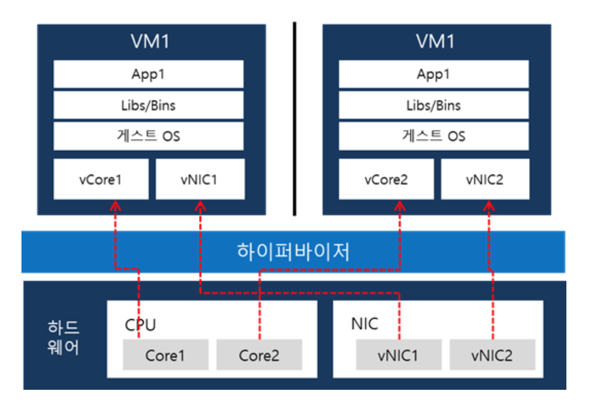

1. Hypervisor를 설명하시오
- 호스트 컴퓨터에서 다수의 운영 체제를 동시에 실행하기 위한 논리적 플랫폼을 말한다. 두 가지 타입으로 나뉜다.

- type1은 하이퍼바이저가 해당 하드웨어에서 직접 실행되며 게스트 운영 체제는 하드웨어 위에서 2번째 수준으로 실행된다. MS의 hyper-V가 대표적이다. type1 가상화는 다시 전가상화와 반가상화로 나뉜다.
  - 전가상화는 게스트 OS를 호스트 시스템과 완전히 분리하여 실행. 게스트 OS는 하드웨어 자원을 요청하기 위해 dom 0라는 가상머신을 통해야 함.
  - 반가상화 방식은 게스트 OS를 일부 수정하여 필요한 하드웨어 자원을 직접 요구할 수 있음.
- type2는 일반 프로그램과 같이 호스트 운영체제에서 실행되며 VM 내부에서 동작되는 게스트 운영체제는 하드웨어에서 3번째 수준으로 실행된다. VMWare, Virtual Box가 대표적이다. 

- VM별로 독립된 가상의 자원을 할당 받는다. VM은 논리적으로 분리되어 있다.

2. Virtualization이란?
- 소프트웨어 기반의 가상의 것을 만들어 내는 것으로 하드웨어 플랫폼, 저장 장치, 네트워크 리소스 등이 포함된다.

3. Hardware-level virtualization
- 하나의 호스트 위에 여러 운영체제를 돌리기 위해서 하드웨어 수준에서 가상화를 적용하는 것. Hypervisor가 대표적이며 이를 이용해서 만들어낸 인스턴스를 VM이라 부른다.

3. OS-level virtualization
- OS 레벨 가상화란 OS 커널이 여러개의 격리된 user space instance를 허용하는 OS 패러다임을 가리킨다. 그리고 이 인스턴스를 컨테이너라고 부른다. 컨테이너들은 호스트 OS의 커널 단을 공유합니다.

4. VM과 컨테이너의 공통점과 차이점
- 공통점: 둘 다 가상화 기술이 적용된 결과물이다.
- 차이점: 어떤 시스템 레벨을 가상화 하는지가 차이가 난다.

- VM 방식은 호스트 OS 위에 하이퍼바이저를 통해서 하드웨어를 가상화 시킨 다음, 게스트 OS 자체를 올린다.
- 반면 컨테이너 방식은 호스트 OS 위에 컨테이너 엔진을 놓고, 그 위에 컨테이너를 실행시킨다. 게스트 OS를 올려놓지 않고, application 실행에 필요한 바이너리만 올라가게 되며, 그 외 커널 부분은 호스트의 커널을 공유한다.

5. 컨테이너의 장단점
- 장점
  - 용량이 적다. 게스트 OS를 띄우는 것이 아니라 호스트의 커널을 공유하기 때문에 그만큼 공간이 절약된다.
  - 속도가 빠르다. 호스트와 커널을 공유하기 때문에 io 처리가 간결하다. vm의 경우에는 게스트 OS가 떠있게 됨으로써 io 발생 시 게스트 os에서 호스트 os로 요청을 보내야 하며, 다시 호스트 os에서 응답을 보내줘야하는 병목이 발생할 수 있다.
- 단점
  - 보안. 컨테이너 하나가 뚫리면 바로 host의 커널이 위험해진다. vm의 경우에는 게스트 OS가 뚫린다 하더라도 호스트 OS는 안전하게 보호된다.
  - 멀티 OS, 커널을 공유하기 때문에 호스트 OS와 전혀 다른 OS를 컨테이너로 올릴 수 없다. 즉, Linux 머신에서 window 서버를 컨테이너로 올릴 수 없다. vm의 경우에는 이러한 제약으로부터 자유롭다.

6. Docker란?
- 도커란 컨테이너 기술을 제공하는 플랫폼입니다. 컨테이너는 OS 레벨의 가상화를 적용하여서 애플리케이션과 그 의존성들을 하나의 컨테이너로 묶어줍니다.

7. Docker 아키텍쳐를 설명하라
- client-server 구조로 되어 있다. 컨테이너를 만들고 띄우는 docker-daemon과 docker-cli로 구성된다. 사용자는 docker-cli를 통해서 docker-daemon의 기능을 사용하게 된다.

8. 리눅스 네임스페이스란?
- 하나의 호스트에서 실행되지만 별개의 공간인 것 처럼 격리된 환경을 제공하는 리눅스 커널의 기능. 리눅스는 6가지 네임스페이스를 제공한다.

8. docker namespace란?
컨테이너에게 격리된 공간을 제공하는 리눅스의 기능. 도커는 호스트에 영향을 주지 않으면서 어느 환경에서든 동작하기 위해서 네임스페이스를 활용한다. PID, Mount, IPC, User, Network 네임스페이스가 사용된다.

9. 컨테이너가 꺼지더라도 데이터를 유지하고 싶다면?
- docker volume을 사용하여 외부 파일 시스템을 컨테이너에 연결한 뒤, volume 공간에 데이터를 저장하면 된다.

10. 도커가 다른 컨테이너 기술과 다른 점이 있다면?
- 도커 컨테이너는 어떠한 클라우드 플랫폼에도 쉽게 배포할 수 있다. 또한 버전 관리가 쉽다. 도커 허브를 통해서 이미지를 백업하고, 배포 및 롤백이 쉬운 장점이 있다.

Q: 도커의 네트워킹 방식을 설명할 수 있는가?
- 도커 컨테이너를 실행하는 시점에 여러가지 네트워킹 방식을 설정할 수 있다.
  - host: 별도의 격리 없이 곧바로 호스트의 네트워크에 연결된다.
  ```
  // 호스트의 80 포트에 곧바로 컨테이너가 연결된다.
  $ docker run --network host nginx
  ```
  - bridge: 컨테이너와 호스트가 브릿지를 통해서 통신한다. 도커의 기본 네트워킹 방식이다. docker0라는 브릿지를 생성하고 이를 통해서 호스트 네트워크와 통신하게 된다. 브릿지 방식에서는 각 컨테이너 별로 네트워크 네임스페이스를 생성한다. veth라는 가상 케이블을 만들어서 컨테이너의 네임스페이스와 docker0 브릿지를 연결한다.

Q: 네트워크 네임스페이스란?
- 
