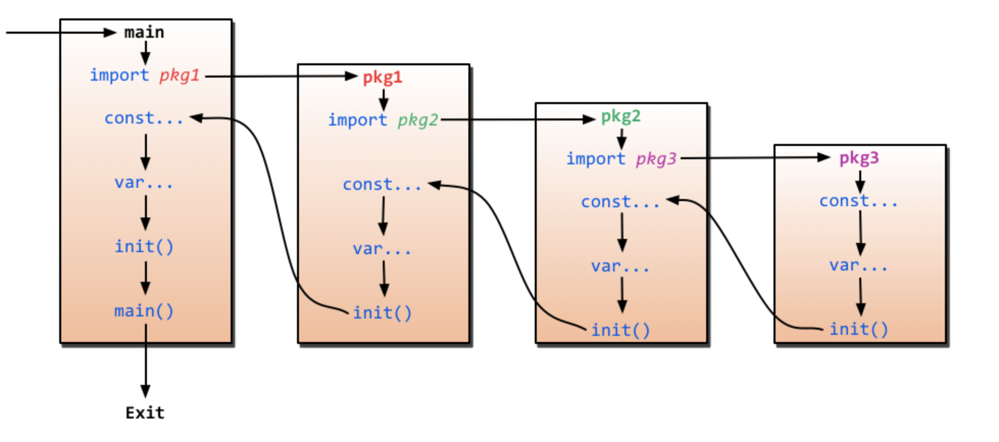

### Q: parallism과 concurrency의 차이를 설명하라
- concurrency: dealing multiple things at once
- parallelism: doing multiple things at once
- parallelism이란 여러 개의 CPU 코어에서 실제로 동시에 여러 연산을 수행하는 것이다. concurrency란 논리적으로 동시에 여러개의 작업을 다루는 것이다. go 언어는 concurrency 언어로, 각각의 고루틴은 쓰레드에 매핑이 되어 CPU 연산을 수행하게 된다.

### Q: goroutine을 설명하라
- 고루틴은 고 런타임이 관리하는 실행 단위로 경량 쓰레드라고 생각하면 된다.
- 고루틴은 생성하는데 2kb 정도의 메모리를 필요로하는 경량 쓰레드이다. 쓰레드는 1MB 정도로 크다.
- 쓰레드는 생성과 소멸시의 비용이 크다. 고루틴은 이러한 비용이 저렴하다.
- 쓰레드는 컨텍스트 스위치 시에 모든 레지스터와 PC, SP의 상태를 저장하고 복원해야한다. 반면 고루틴은 오직 3개의 레지스터, PC, SP, DX만 저장하고 복원하므로 비용이 훨씬 적다.
- 즉, 크기가 작고 생성과 소멸이 가벼우며 컨텍스트 스위치가 가볍다. 쓰레드를 다시 잘게 쪼개어 사용하는 경량 쓰레드
- 개발자는 실제 쓰레드를 알지 못해도 돼고, OS는 고루틴을 알지 못한다. OS 입장에서 고루틴은 이벤트 드리븐 방식으로 동작하는 C 프로그램이다.

### Q: go는 정적 타입 언어인가 동적 타입 언어인가?
- 정적 타입 언어이며, 자동 형변환을 지원하지 않는 강타입 언어이다.

### Q: virtual machine을 사용하는 언어와 go의 차이점을 설명하라.
- go는 컴파일하면 머신에서 바로 실행할 수 있는 바이너리가 만들어진다. 반면 java를 컴파일하면 jvm 위에서 실행하는 바이트코드가 만들어진다. 이는 호스트 머신 위에 가상 머신을 실행시키고 그 위에서 바이트코드를 실행하게 된다.

### Q: go 언어의 장점을 설명하라
- concurrency 구현이 쉽다.
- 컴파일 시간이 빠르다.
- 가상머신을 사용하지 않음에도 garbage collection 기능 사용이 가능하다.
- 성능이 좋다. 컴파일 결과로 하드웨어에서 바로 실행이 가능한 바이너리를 생성할 수 있다.
- 체널을 활용한 동기화가 편하다.
- 멀티코어 CPU를 손쉽게 활용할 수 있다.

### Q: go는 object oriented language인가?
- oop언어이면서도 아니다. go는 oop 프로그래밍 스타일을 지원한다. 그러나 타입 간의 계층 관계가 존재하지 않는다. oop 언어의 대표적인 특징은 클래스와 상속을 지원하지 않는다. 대신 struct와 interface를 통해서 oop스럽게 코딩할 수 있다. struct embedding을 이용해서 상속을 구현할 수 있으며, interface를 이용해서 다형성을 구현할 수 있다.

### Q: go의 duck typing에 대해서 설명하라
- duck typing이란 인스턴스의 실제 타입은 상관하지 않고 구현된 메서드 만으로 타입을 판단하는 기법으로 go에서는 interface를 이용해서 구현할 수 있다. 즉, 어떤 구조체가 인터페이스에 정의된 모든 함수를 구현한다면 이를 인터페이스 객체 타입으로 간주하는 것이다.

### Q: generic이란 무엇이며 왜 go는 generic을 지원하지 않는가
- generic이란 형식 매개변수를 사용하는 함수나 type을 의미. generic이 없는 것이 그동안 go의 약점으로 지목되어왔는데, go 1.17부터는 generic을 지원할 계획이라고 밝힘

### Q: go reflection이란?
- 런 타임에 인터페이스나 구조체의 타입 정보를 알아내는 기능. 이를 통해 구조체의 테그를 가져올 수도 있음. 
- 리플렉션을 사용해 동적으로 함수를 생성하는 것도 가능

### Q: go init() 함수란 무엇인가
- init()이란 패키지 내부에 모든 변수들이 선언된 이후, 초기화를 한꺼번에 실행하는 함수이다. 만일 패키지 내부에서 다른 패키지를 import 했다면 내장 패키지를 먼저 init하고난 뒤, 원래 패키지를 init한다.

### Q: go의 GC에 대해서 설명하라
- MarkWorker goroutine이 재귀적으로 모든 객체를 스캔하며  while, gray, black으로 coloring을 수행한다. white는 접근 불가능, gray는 pending, black은 접근 가능을 의미하며, gray는 시간 경과에 따라서 white 혹은 black 상태가 된다. GC는 접근 불가능한 객체들을 메모리 해제하여 heap 공간을 확보한다. GC가 동작하는 동안에는 잠시 모든 고루틴을 멈추고 일괄 할당 해제를 수행한다.

### Q: go의 array와 slice의 차이를 설명하라
- slice는 동적으로 크기가 늘어나는 배열로 make 명령어를 사용하여 생성이 가능
- slice는 capacity 설정이 가능하며 용량이 가득 찰 경우 자동으로 늘어남
- slice는 레퍼런스 타입으로 내장된 배열에 대한 포인터를 담는다. 따라서 복사를 하고 싶다면 copy를 사용해야 한다.

### Q: 클로져를 설명하라
- 함수 아래에 정의된 함수에서 자신을 감싸고 있는 함수 영역에 정의된 변수에 접근할 수 있는 것을 가리킴.
- 함수의 지역 변수는 함수 호출이 끝나면 할당 해제가 되지만, 클로저 변수는 함수 실행이 끝나더라도 유지
- 이를 통해서 함수 실행 결과를 유지할 수 있으며, 프로그램의 흐름을 변수에 저장할 수 있다.
- 클로져는 함수형 언어의 큰 특징으로 go에서는 클로져를 통해서 함수형 언어를 구현한다.

네이버 데브옵스 엔지니어 
클라우드, 데브옵스, 백엔드 개발에 관심을 갖고 다양한 프로젝트와 인턴쉽을 경험하였다. 그리고 그 과정에서 커다란 시스템을 구축하고, 운영하는 분야에 특히 관심을 갖게 되었고, 이러한 분야로 커리어를 쌓고 싶다는 생각을 하게 되었다. 네이버 검색 서버는 국내 최대 규모의 서비스 중 하나로 알고있다. 이러한 팀에서라면 
