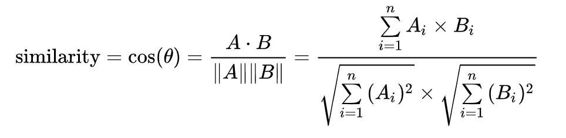
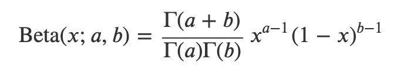
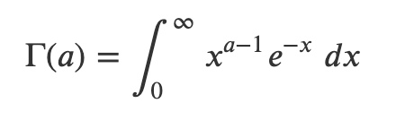
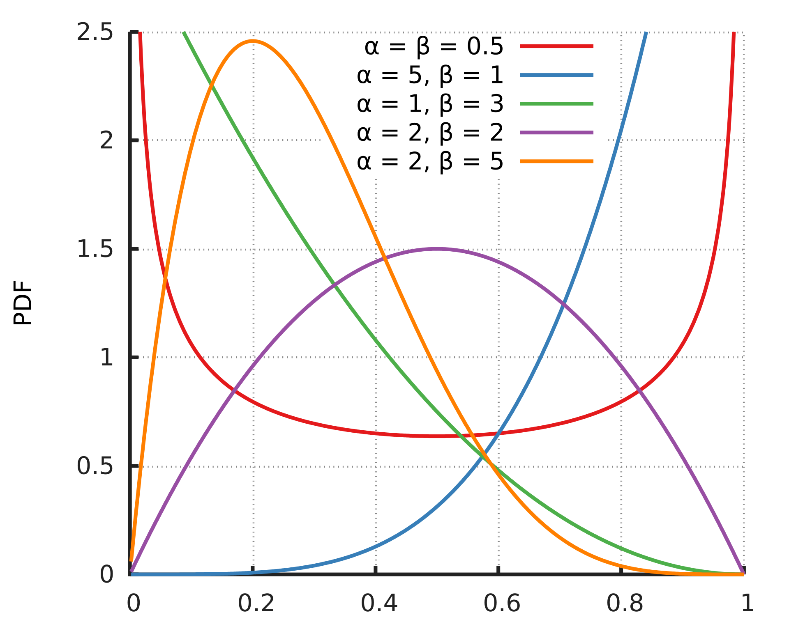

## tf-idf 뉴스 클러스터링
### tf-idf 기초 개념
- tf-idf: 여러 문서로 이루어진 문서군이 있을 때, 어떤 단어가 특정 문서 내에서 얼마나 중요한 지를 나타내는 통계적 수치. tf와 idf 값의 곱으로 계산할 수 있다. 전체 문서군에서는 적게 등장하면서 특정 문서 내에서 많이 등장하는 단어일 수록 높은 값을 가진다.
- tf(term frequency): 특정 단어가 문서 내에서 얼마나 자주 등장하는가, 단어 자체의 빈도 수
- augmented tf: 기본값 0.5를 더해준 뒤, 기본 f(t,d) 값에 0.5를 곱해주고 이를 문서 내에서 가장 많이 등장한 단어의 빈도 수로 나눈 값으로 나눠준다. 이렇게 해주는 이유는 단순 빈도수로 tf 값을 계산할 시에는 길이가 긴 문서가 더 높은 스코어를 얻게되는 경향을 방지하기 위해서이다. 이렇게 tf를 계산할 시, 문서에 등장하지 않는 단어의 경우에는 0.5 tf 스코어를 갖게 된다.
- df(document frequency): 특정 단어가 등장하는 문서의 수를 전체 문서 수로 나누어준 값
- idf(inverse document frequency): df의 역수의 로그 스케일
- idf에 로그 스케일을 적용하는 이유: 지프의 법칙이라 하여 말뭉치 데이터 셋에서 가장 많이 등장하는 단어는 그 다음 등장하는 단어의 약 2배 정도 많이 등장한다는 법칙. 즉, 단어의 빈도수는 지수적인 분포를 띄고 있으며, 이를 선형으로 변환시켜주기 위해서 로그 스케일을 적용한다.

### tf-idf 장단점
- 장점
  - 문서 내 단어의 빈도 수와 전체 문서군 내에서의 단어의 희소성을 동시에 고려할 수 있다.
  - 단순하면서도 뛰어난 성능을 보여주어 많은 연구에서 baseline으로 활용된다.
- 단점
  - 단순히 단어의 빈도 수만 체크하여 해당 단어의 의미를 고려하지 못한다. 예를들어 동음이의어를 구별하지 않고 동일한 단어로 인식하여 빈도 수를 센다.
  - 단어 단위로 카운팅을 하는데 띄어쓰기나 조사 때문에 동일한 단어를 제대로 카운팅하지 못할 수 있다. 이 경우 제대로 된 tf를 집계하지 못할 수 있다.
  - 새로운 문서가 추가될 경우 전체 문서군의 idf 스코어를 업데이트 해야한다. 따라서 얼마나 자주 전체 문서들의 벡터를 업데이트 할 것인가를 고려해야한다.

### 프러덕션 환경에서 tf-idf를 어떻게 운영할 수 있는가?
- 처음 tf-idf를 구성할 때 최대한 많은 문서가 포함될 수 있도록 하여 중간에 새로운 문서들이 추가되거나 새로운 어휘가 발견되더라도 tf-idf 스코어에 주는 영향이 작도록 한다.
- 형태소 분석기 등을 통해서 의미를 가진 단어들을 추출할 수 있도록 하며, 관사나 조사는 불용어 처리를 한다.
- 적절한 tf-idf 스코어 업데이트 주기를 설정하여 최신 문서에 대한 정보가 반영될 수 있도록 한다.

### Cosine Similarity

- 두 벡터간의 각도를 코사인 값을 이용하여 측정된 벡터간의 유사한 정도. 각도가 0일때 1, 90도일 경우 0, 180도일 경우 -1 값을 갖는다. 
- 두 문서간의 cosine similarity는 0에서 1사이 값을 갖는다. 왜냐하면 tf-idf 스코어 값은 무조건 양수이기 때문. (augmented tf는 0.5 ~ 1 사이 값을 갖고 idf 값은 0부터 무한대까지의 값을 갖는다.) 따라서 두 문서 벡터간의 cosine similarity는 0에서 1 사이 값을 갖는다.
- 벡터의 크기는 값에 아무런 영향을 미치지 않는다. 왜냐? normalize를 하기 때문

### Clustering
- 클러스터란 비슷한 특성을 가진 집단을 의미하며 그 집단을 대표할 수 있는 대표점을 찾는다. 대표적인 비지도 학습의 알고리즘이다.

### 클러스터링 알고리즘 종류
- k-means clustering: 임의의 k개의 점을 찾아 대표로 삼는다. 나머지 데이터 포인트들은 자신으로부터 가장 가까운 대표점 클러스터로 분류된다. 다음 스텝에서 대표점을 분류된 점들의 중심점으로 업데이트한다. 이 과정을 반복하며 수렴시킨다. 데이터의 분포가 원형일 꺼라는 가정을 하고, 초기화 지점에 따라서 결과가 달라진다는 단점이 있다.
- agglomerative: bottom up 접근 방법으로 데이터들을 서로 가까이 위치한 데이터 포인트끼리 묶어가면서 클러스터를 구성한다. 그러나 이 역시 복잡한 형태의 데이터를 제대로 클러스터링해내지 못하는 문제점이 있다.
- DBSCAN: density bawsed spatial clustering of applications with noise, 밀도 기반으로 클러스터링을 진행, 특정 범위 내에 속하는 데이터 포인트의 개수가 일정수 이상일  때 클러스터로 묶어줌. 예외값을 걸러내는데 유리, 복잡한 데이터를 클러스터 하는데 상대적으로 유리

## 멀티 암드 밴딧, 베타 분포
### 멀티 암드 밴딧 기초 개념
- multi-armed-bandit: 한정된 자원을 경쟁을 통해서 할당해야하는 상황에서 기대되는 보상을 최대한 끌어올릴 수 있도록 선택해야 하는 문제이다. 이때, 주어진 선택지들의 보상에 대해서 여러번 할당을 할 수록 더 잘 이해할 수 있다. 

### 추천에 어떻게 멀티 암드 밴딧이 적용되는가?
- 개별 아이템을 하나의 밴딧 머신이며, 클릭률이 높은 머신을 기대 보상이 큰 머신을 볼 수 있다. 실제 사용자들에게 아이템들이 노출되기 전까지 어떤 아이템이 클릭률이 높을지 알 수 없다. 따라서 사용자들의 피드백을 지속적으로 반영하여 클릭률이 높은 머신을 찾아내고, 이를 사용자에게 추천해주는 방식으로 멀티 암드 밴딧 알고리즘을 적용할 수 있다.

### exploit, exploer 개념을 설명할 수 있는가?
- exploit은 현재까지 탐색한 결과를 놓고 가장 보상이 큰 아이템을 노출시키는 것이다. explore는 아직 충분히 탐색되지 않았을 수 있으니 그 외의 아이템들을 사용자들에게 노출시키는 것이다. 이러한 explorer와 exploit은 trade-off 관계에 놓여있다.

### multi-armed-bandit 알고리즘의 종류를 설명할 수 있는가?
- greedy: 초기 탐색 후, 보상이 최대가 되는 머신을 선택
- e-greedy: 보상이 최대가 되는 머신을 선택하되, 일정 확률로 랜덤한 머신을 선택
- UCB(Upper-Confidence-Bound): 최적이 될 수 있는 가능성을 수치로 계산해서 가장 가능성이 있는 슬럿머신을 선택. 전체 선택 횟수 가운데 특정 머신을 선택한 횟수가 적을 수록 높은 값을 갖게 됨.

### 베타 분포
- 베타 분포는 두 파라미터 alpha와 beta에 의해 [0, 1] 사이 구간에서 형태가 결정되는 연속 확률 분포이다.

- 감마 함수: 팩토리얼을 복소수 체계로 확장하여 함수화 한 것
- 베타 함수: 감마 함수의 비로 나타내어지는 2변수 특수 함수
- 알파가 베타보다 커질 수록 평균이 1에 가까워지며, 반대의 경우 0에 가까워진다. 때문에 알파는 클릭 횟수, 베타는 노출 횟수에 해당한다.

### 톰슨 샘플링을 설명할 수 있는가?
- 톰슨 샘플링은 각 아이템들의 보상률 자체가 베타 분포를 따를 것임을 가정
- 각 아이템 별로 노출 횟수와 클릭 횟수를 집계하고 이를 바탕으로 베타 분포를 결정
- 노출시킬 아이템을 선택할 때 각 아이템들의 베타 분포에서 클릭률을 샘플링 한 뒤, 가장 클릭률이 높을 것 같은 아이템을 추천

### 톰슨 샘플링의 수렴 과정을 설명할 수 있는가?
- 사용자들의 피드백 데이터들이 쌓이면서 각 아이템들의 베타 분포를 계속해서 업데이트 
- 일정 시점에 이르면 개별 데이터가 분포에 미치는 영향력이 줄어들고, 분포의 형태가 수렴
- 주어진 문제는 각 아이템들의 베타 분포의 분산을 통해서 수렴 여부를 결정하였습니다. 
