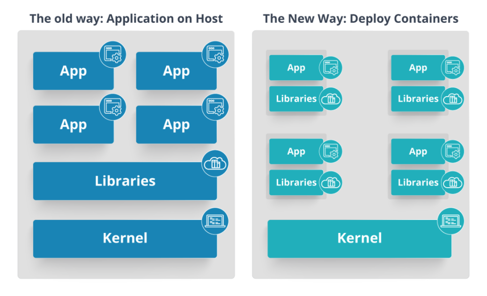

## Kubernetes
#### Q: 쿠버네티스란?
- 오픈 소스 컨테이너 오케스트레이션 툴이자 시스템입니다. 이는 다수의 컨테이너의 모니터링, 확장, 배포 등을 담당합니다.

#### Q: 쿠버네티스와 도커는 어떻게 관련되는가?
- 쿠버네티스가 동작하기 위해서는 컨테이너 런타임이 필요하다. 여러가지 솔루션을 사용할 수 있지만, 도커가 가장 대표적이다. 도커를 통해서 컨테이너를 만들고, 이를 쿠버네티스가 관리한다.

#### Q: 도커 스웜과 쿠버네티스의 차이점은?
- 도커 스웜은 도커 자체의 오케스트레이션 툴이다.
- 쿠버네티스는 오토 스케일링을 지원한다.
- 쿠버네티스는 자동 롤백을 지원한다.
- 쿠버네티스는 같은 파드 내의 컨테이너들끼리만 스토리지를 공유한다. 도커 스웜은 모든 컨테이너들이 서로 볼륨을 공유할 수 있다.
- 쿠버네티스는 로깅 도구를 내장하고 있다.

#### Q: MSA란?
- 어플리케이션을 느슨하게 결합된 서비스들의 집합으로 구성하는 것. 

#### Q: MSA의 장점을 설명하라
- 소프트웨어의 이해, 개발, 테스트가 쉬워진다.
- 규모가 작은 자율적인 팀들이 팀별 서비스를 독립저긍로 개발, 전개, 규모 확장이 가능하다.
- 각 서비스 별로 독립적인 배포가 가능하다.

#### Q: MSA의 단점을 설명하라
- 하나의 컴포넌트가 느려지거나 장애가 나면 이를 호출하는 종속 컴포넌트까지 장애가 전파된다.

#### Q: 쿠버네티스의 아키텍쳐를 설명하라
- 마스터 노드와 워커 노드로 구성된다. 마스터 노드는 워커 노드들을 제어하기 위한 컨트롤 플레인 컴포넌트들을 띄우게 된다. kube-apiserver, kube-controller-manager, kube-scheduler, etcd 등이 있다.(etcd는 별도의 클러스터로 구성할 수도 있다.)
- 워커 노드의 경우 실제 컨테이너를 띄우기 위해서 kubelet과 컨테이너 런타임이 뜨게 된다. 그리고 인터넷과의 통신을 위해 kube-proxy 파드가 뜨게 된다.

#### Q: kubernetes pod란?
- 쿠버네티스에서 가장 작은 배포 단위이며 하나 이상의 컨테이너를 포함한다. 같은 파드 내의 컨테이너들은 파일 시스템과 네트워크 리소스를 공유하게 된다.

#### Q: kube-proxy란?
- ip와 port에 맞는 컨테이너에 트래픽을 전달해주는 역할을 수행한다. daemonset 형태로 클러스터 내에 배포되어 각 노드마다 하나의 kube-proxy 파드가 떠있게 된다.

#### Q: heapster란?
- 쿠버네티스에서 모니터링을 위하여 메트릭을 수집하는 도구로 사용되었으나, 현재는 deprecated된 소프트웨어.

#### Q: kubernetes namespace를 설명하라
- 쿠버네티스 클러스터의 리소스를 나누는 것을 의미한다. 이를 통해 서로 다른 팀이 같은 클러스터 내에서 작업을 진행할 수도 있고, dev, stage, prod와 같은 환경 분리를 구현할 수도 있다.

#### Q: kubernetes controller manager란?
- 쿠버네티스에는 다양한 controller들이 있다. namespace controller, node controller, token controller, replication controller 등이 있다. 컨트롤러들은 논리적으로는 개별 프로세스이지만, 복잡도를 줄이기 위해 하나의 바이너리로 컴파일해서 단일 프로세스로 실행시키며, 이를 controller manager라 부른다.

#### Q: etcd를 설명하라
- 분산 key-value 저장소로 클러스터의 현재 상태, 설정 값 등을 저장하며 kube-apiserver하고만 통신한다.

#### Q: 쿠버네티스 서비스에는 어떠한 종류가 있는가?
- ClusterIP, NodePort, Load Balancer, externalname이 있다. clusterip는 파드에 클러스터 내부에서 사용 가능한 영구 ip를 부여하며, 로드 밸런싱 역할도 수행한다. nodeport는 파드의 특정 포트를 클러스터 외부에 노출시킨다. load balancer는 cloud provider의 load balancer를 이용해서 서비스를 외부에 노출시키는 역할을 수행한다.externalname은 클러스터 내부에서 외부 서비스를 호출할 때 사용한다. 클러스터 외부 도메인에 대한 요청을 마치 내부 서비스 요청처럼 처리할 수 있다.

#### Q: headless service를 설명하라
- 서비스를 만들 때 clusterip를 None으로 설정하여 만들 수 있다. 로드 밸런싱이 필요 없거나 단일 서비스 IP가 필요 없는 경우 이런 헤드리스 서비스를 이용한다. 프록시를 통하지 않고 파드에 직접 접근할 수 있다. 헤드리스 서비스는 StatefulSet에 적합하다. 개별 파드들이 고유하고, 로드 밸런싱이 필요 없는 상황에서 파드에 dns를 부여해주는 역할을 수행한다.

#### Q: Kubelet이란?
- 파드를 만들고 관리하는 역할을 담당. 마스터 노드, 워커 노드 모두에서 동작.kube-apiserver와 통신하여 파드의 스펙을 읽어온 뒤, 유지해야하는 상태에 맞춰서 파드들을 관리한다.

#### Q: kubectl이란?
- kubernetes command를 사용할 수 있는 command line interface이다.

#### Q: ingress를 설명하라
- 클러스터 외부에서 내부로 접근하는 요청들을 어떻게 처리할 지 정의해둔 규칙들의 모음. 외부에서 접근 가능한 URL을 사용할 수 있게 하고, 로드 밸런싱과 SSL 인증서 처리를 해준다. 인그레스 자체는 이런 규칙들을 정의해둔 자원이고 이런 규칙들을 실제로 동작하게 해주는 것이 ingress controller이다.

#### Q: kube-scheduler를 설명하라
- 스케쥴링이란 쿠버네티스가 새롭게 파드를 만들어 배포할 때 적합한 노드를 선택하는 것을 말한다. 이 때 다양한 요소들을 고려할 수 있는데 먼저 파드 자체가 특정 노드에 배포되도록 node-selector를 이용할 수 있다. 또한 affinity를 이용하여 특정 라벨을 지닌 노드에 배포되도록 설정할 수 있다. 파드가 요구하는 리소스 양도 스케쥴링에 영향을 미치는데, 파드가 요구하는 최소 cpu, 최소 메모리를 만족하는 노드들 가운데 가장 여유가 많은 노드를 선택하여 스케쥴링하게 된다.

#### Q: deployment에서 replica에 숫자를 늘려주었으나 아무런 변화가 없다. 문제가 무엇일 것 같은가?
- 여러가지 상황이 문제일 것 같다. 우선 현재 deployment나 pod의 상태를 보아야한다. 만일 파드들이 생성되었고 전부 pending 상태라면 현재 클러스터에 리소스가 부족한 상황을 생각해볼 수 있다. 아예 파드 생성조차 못하고 있다면 kube-scheduler 파드가 장애를 일으키고 있을 가능성이 있다.

#### Q: deployment가 rolling update를 수행하는 과정을 설명하라
- replicaset을 하나 추가로 생성한 뒤에 새로운 버전의 파드를 생성합니다. 새로운 파드가 생성되면 기존의 파드를 제거합니다. 이 때, 새롭게 만드는 파드와 종료하는 파드의 수는 deployment의 maxSurge와 maxUnavailable로 설정할 수 있습니다.

#### Q: canary 배포에 대해서 설명하라
- canary 배포는 현재 배포되어있는 파드들을 모두 새로운 버전으로 업데이트 하는 것이 아니라, 일부만 새로운 버전으로 업데이트합니다. 그 다음 트래픽을 받으면서 새로운 버전이 제대로 동작하는 지를 확인한 다음, 나머지 파드들을 업데이트 하는 배포 방식을 말합니다.

#### Q: canary 배포를 쿠버네티스에서 어떻게 구현할 수 있는가?
- 라벨을 통해서 구현이 가능합니다. 일부 파드에 카나리 배포에 해당하는 라벨을 주고, 해당 라벨을 포함하는 파드만 새로운 버젼의 컨테이너로 업데이트를 시킵니다. 그리고 해당 파드들이 정상적으로 동작하는 지를 확인한 이후에 나머지 파드들을 업데이트 합니다.

#### Q: Horizontal Pod Autoscaler
- 현재 배포되어 동작하는 파드들이 사용하는 리소스 양을 집계하여 기준치를 초과하면 추가적으로 파드를 늘려주는 오토 스케일링을 의미합니다.

#### Q: 어플리케이션을 그대로 호스트에 배포하는 것과 컨테이너로 배포하는 것은 어떤 차이가 있는가

- 컨테이너의 경우 애플리케이션 실행에 필요한 바이너리와 의존 라이브러리를 패키지화 하여 배포되며, 컨테이너는 격리된 환경에서 동작한다. 그러므로 어플리케이션 사이의 의존성 충돌로부터 안전하며, 호스트에 상관없이 동일하게 동작한다.

#### Q: repliacset과 replica controller는 무슨 차이가 있는가?
- replicaset은 selector를 사용하여 관리할 파드를 지정할 수 있다. 이를 통해 현재 배포되어 동작 중인 파드에 replicaset을 연결할 수 있다.

#### Q: CNI에 대해서 설명하라
Container Networking
- Interface의 약자로 컨테이너가 네트워크에 연결되기 위해서 필요한 일련의 작업들을 규격화 시켜놓은 것이다. 예를들어 컨테이너가 사용할 네트워크 네임스페이스를 만들고, 가상회선을 사용하여 이를 호스트의 브릿지에 연결하고, 브릿지를 다시 NAT을 통해 호스트의 인터페이스에 연결시켜주고, IP를 할당하며 NAT과 인터페이스를 활성화 시켜주는 과정을 거쳐야 한다. 이를 bridge라는 하나의 프로그램으로 합쳤다.
- 컨테이너 런타임은 여러개가 존재한다. 때문에 이들이 각각 어떻게 브릿지를 사용할 지 통일할 필요가 있어써 만든게 CNI이다.
- CNI는 먼저 컨테이너 런타임이 지켜야할 조건들을 명시했다.
  - 컨테이너 런타임은 네트워크 네임스페이스를 생성해야 한다.
  - 컨테이너가 연결되어야 할 네트워크를 구분할 수 있어야한다.
  - 컨테이너를 추가하거나 삭제할 때 네트워크 플러그인을 호출해야한다. (도커는 CNI를 따르지 않음. 그래서 자체 브릿지인 docker0를 사용)
  - JSON 포맷으로 네트워크 설정을 해야한다.
- CNI는 그다음 플러그인들이 어떠한 조건을 지켜야하는지 명시했다.
  - ADD/DEL/CHECK 등의 커맨드를 지원해야한다.
  - container id, network ns 등의 파라미터를 지원해야한다.
  - 파드의 IP 주소 할당을 관리할 수 있어야 한다.
  - 결과를 특정한 포맷으로 리턴해야 한다.

#### Q: 쿠버네티스에서 CNI는 어떠한 역할을 수행하는가?
- 모든 파드는 유니크한 IP를 가져야 한다. 같은 노드 내의 파드는 서로 통신할 수 있다. 서로 다른 노드에 배포되어 있는 파드랑은 NAT을 통해서 통신할 수 있어야한다.
- 이러한 요구조건을 모두 구현해놓은 써드파티 솔루션들이 있으며, calico. flannel, weave 등이 그것이다.

#### Q: 쿠버네티스 클러스터 네크워킹 과정을 설명하라
- 각각의 노드에 브릿지를 생성하고 브릿지별로 서브넷 ip를 부여한다. 각 노드에서 파드를 생성하고 IP를 부여할 때 서브넷을 활용하면 유니크한 IP를 부여할 수 있다.
- 라우팅 테이블을 이용해서 각 노드들의 IP와 서브넷을 연결해준다. 그러면 이제 서브넷들을 하나의 큰 네트워크로 묶어줄 수 있다.
- 이러한 과정들을 모두 대신해주는 것이 CNI의 역할이다.

#### Q: 쿠버네티스 내부 TLS 통신 방식을 설명하시오
- 쿠버네티스는 외부 사용자와의 통신, 클러스터 내부 컴포넌트 사이의 통신 시에 TLS 암호화를 보안 통신을 한다. 이는 공개키와 개인키를 사용하는 비대칭 암호화 방식이다. 먼저 쿠버네티스는 인증기관의 역할을 할 CA의 공개키와 암호키를 만든 뒤, self sign 방식으로 CA 인증서를 만든다. 다음 각각의 쿠버네티스 컴포넌트들은 자기 자신의 개인키와 공개키를 만들고, 공개키에 CA의 인증을 받는다. 인증을 획득한 공개키를 활용하여 개인키를 교환한 뒤, 보안 통신을 수행한다.
