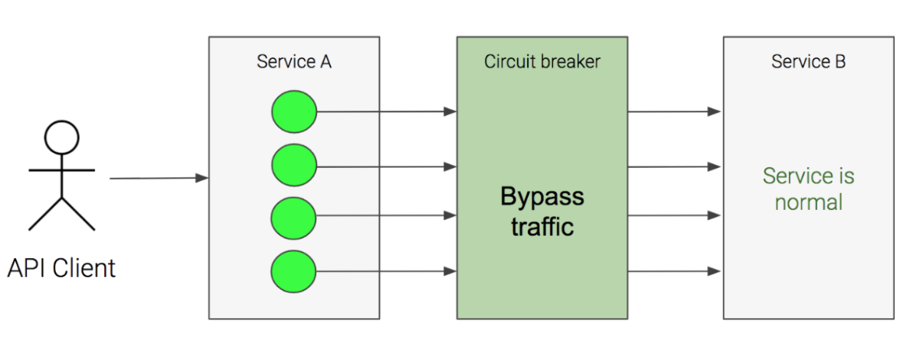
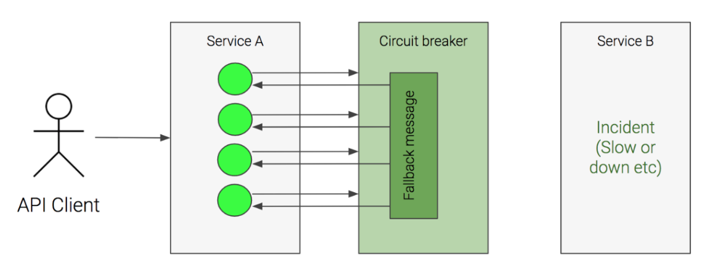

### 서비스 매쉬
Q: 서비스 매쉬란?
- 마이크로 서비스 아키텍쳐에서 서비스와 서비스간의 통신을 더 효과적으로 제어하기 위한 레이어. istio에서는 사이드카 패턴으로 프록시를 배포하는 방식으로 구현. 서비스 간 통신을 모니터링 할 수 있으며 보안 통신을 제공하고 실패한 요청의 재요청 등을 제공한다.

Q: circuit breaker 패턴을 설명하라

- 서비스와 서비스 사이에 circuit breaker를 둔다. 서비스 B가 정상 작동할 때에는 문제없이 트래픽을 전달하지만, 느려지거나 장애가 났을 경우에는 circuit breaker 단에서 fallback message를 전송하고 서비스 B에 트래픽을 전달하지 않는다. fallback message로는 default 값 등이 될 수 있다.
- 이러한 circuit breaker를 소프트웨어 단에서 적용할 수 있는 프레임워크로는 Hystrix, Spring이 있다.
- 소프트웨어가 아닌 인프라 단에 적용하고 싶다면 envoy.io라는 프록시 서버를 이용하면 된다.

Q: 서비스 디스커버리를 설명하라
- 클라우드 환경에서 서비스가 오토 스케일링 등에 의해 동적으로 생성되거나 스케쥴링에 의해 다른 노드로 이동하는 등의 변화로 ip가 변화하는 일이 잦아졌다. 그래서 클라이언트가 서비스를 호출할 때 서비스의 위치를 알아낼 수 있는 기능이 필요한데 이를 서비스 디스커버리라 부른다. 즉, 클라이언트가 Service A를 호출하기 위해서 미리 Service Registry에 요청을 보내어 ip를 알아내야 한다.

Q: Envoy를 설명하라
- 마이크로 서비스 아키텍쳐가 발전하면서 서비스 간의 통신을 라우팅할 필요가 많아지면서 이를 소프트웨어 단이 아니라 인프라 단에서 처리할 수 있는 기술로 프록시가 유용하다.
