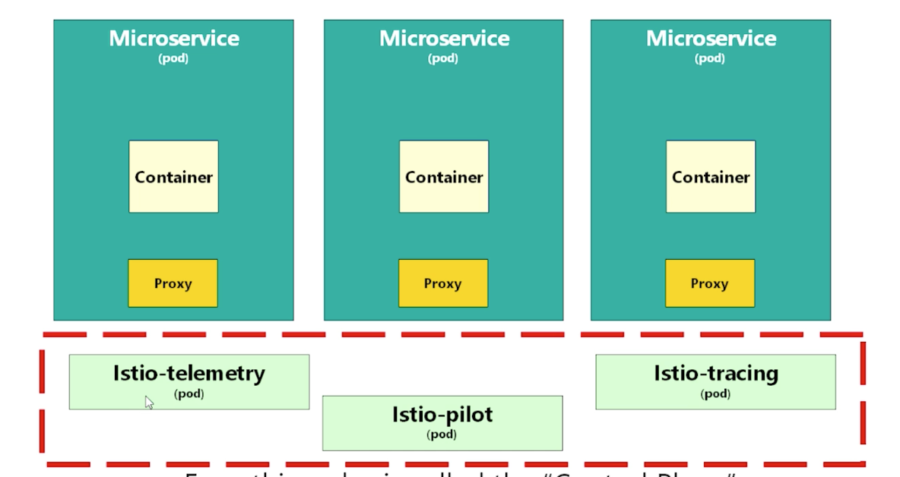

### what is istio?
- Istio is Service mesh
- Service Mesh is an extra layer of software you deploy alongside your cluser(eg kubernetes)

### Service Mesh란?
- 쿠버네티스 기반이 마이크로 서비스 아키텍쳐 어플리케이션에서는 여러 개의 파드 안에 컨테이너들이 떠있게 된다. 쿠버네티스는 이러한 파드를 컨트롤하는데에는 편리한 기능들을 제공한다. 그러나 파드 간의 커넥션을 관리하는 것에 한계가 있다.
- 이를 소프트웨어 레이어를 추가한 뒤, 파드 간의 커넥션을 쉽게 관리하자는 것이 서비스 메쉬!

- 다른 파드와 통신하고 싶다면 서비스 메쉬에 요청을 넣고, 서비스 메쉬 측이 다른 파드에 요청을 전달한다. 또한 서비스 메쉬는 단순히 통신을 전달하는 역할에 그치지 않고 추가적인 기능들을 끼워넣을 수 있다.
- 서비스 메쉬를 통해서 파드간의 복잡한 통신 구조를 트래킹 할 수 있다. 이를 쿠버네티스만을 하기에는 트래픽 관리나 보안 관리가 어렵다. 이러한 서비스 메쉬 기능을 제공하는 것이 istio이다.

### Istio 동작 방식

- istio는 각 파드에 istio proxy 컨테이너를 띄운다. 파드 안의 컨테이너는 istio proxy 컨테이너를 통해서 통신을 한다.
- 다른 파드와 통신을 하고 싶다면 프록시를 통해 다른 파드의 프록시에 요처을 보내고, 다시 프록시가 이를 수신 컨테이너에 전달한다.
- istio라는 namespace에 istio-telemetry라는 파드를 띄우고, 이 파드를 통해서 개별 파드들에 떠있는 프록시들을 통제하게 된다.

- 각 파드에 떠있는 proxy를 data plane이라 부르며, 파드 외부의 Istio-telemetry, Istio-pilot, Istio-tracing과 같은 파드들을 control plane이라 부른다.

### istio pod 구성

- prometheus, grafana: 메트릭 수집, 시각화
- istio-egressgateway, istio-ingressgateway: istio에서 트레픽 제어를 담당하는 파드들
- istio-tracing: 아직 잘 모르겠음
- istiod: istio daemon을 띄우는 파드
- kiali: 클러스터 시각화 도구

### istio sidecar 패턴
- istio namespace에 control plan pod들이 떠있다. 이는 네임 스페이스 단위로 적용이 가능하며, 네임 스페이스에 istio-injection=enabled라는 라벨을 추가해줌으로써 가능하다.
- 해당 라벨을 추가한 네임 스페이스에 파드를 추가하면 자동으로 istio proxy 컨테이너를 사이드 카에 추가해서 배포되게 된다.
- istio-injection이 실행되면 먼저 init container를 통해서 istio 실행에 필요한 설정을 완료한 뒤, istio-proxy 컨테이너와 함께 본래 띄우고자 했던 컨테이너가 뜨게 된다.

### kiali
- istio가 동작하는 마이크로 서비스가 어떻게 동작하고 있는지를 시각화 시켜주는 도구(매우 신기하다.)
- 전체 시스템에 대한 사전 지식이 없더라도 시각화를 통해서 어느 부분에서 장애가 발생하고 있는지를 직관적으로 파악할 수 있게 도와준다.

### Jaeger UI
- 마이크로 서비스 아키텍쳐 상에서 네트워크 문제가 발생했을 때 이를 추적해서 원인을 알려주는 도구

