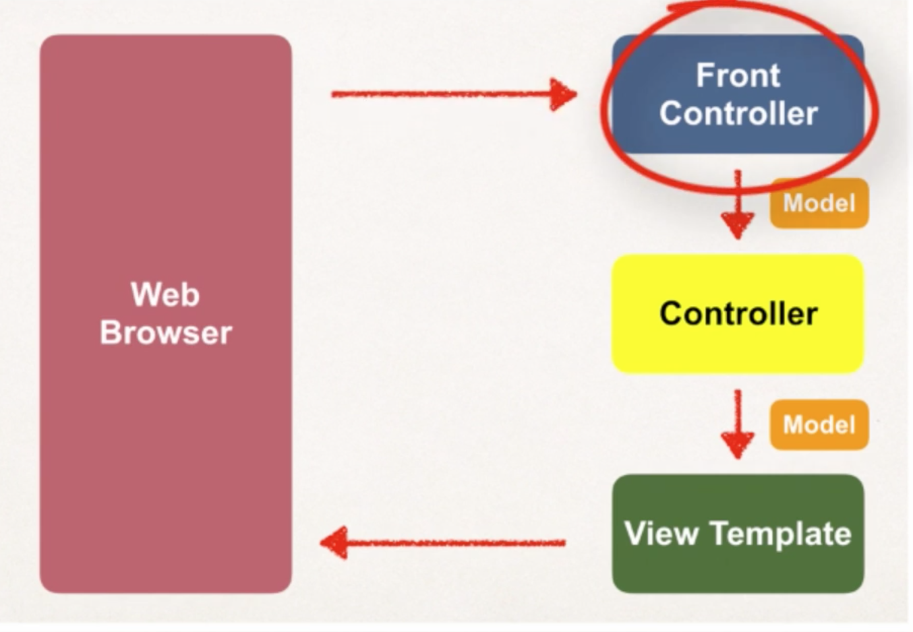

### Spring MVC
- MVC 방식으로 웹 서비스를 구성할 수 있으며, 결국 이들은 beans들을 조합한 결과이다.

- front controller는 DispatcherServlet이라고도 알려져있다. Spring Framework의 일부이다.
- 개발자가 개발해야할 것은 Model, View templates, Controller classes이다. (오렌지, 옐로우, 그린)
- view는 JSP로 개발할 수도 있고, 다른 스택들로 개발할 수도 있다.
- controller가 business logic을 담는 부분이다. 요청을 처리하고, 데이터를 저장하거나 읽어온다.
- model은 데이터를 담고 있다. view template로 전달되어진다.
- view template으로 가장 일반적으로 쓰이는 것은 JSP와 JSTL이다. 모델에 담겨진 데이터를 가지고 html을 만들어 사용자에게 보여준다.

### Spring MVC 개발 프로세스
- configuration file 추가 (WEB-INF/web.xml)
  - Spring MVC Dispatcher Servlet 설정
  - Spring MVC Dispatcher Servlet에 URL 맵핑 설정
- Web-INF/spring-mvc-demo-servlet.xml 파일 추가
  - component scanning 설정
  - conversion, formatting, validation 설정
  - resolver 추가

### Spring MVC 개발환경 셋팅
- eclipse에서 perspective를 Java EE로 바꿔준 뒤, New -> Dynamic Web Application을 생성
- WebContent > WEB-INF > lib 아래에 Spring JAR 파일을 넣어준다.
- WebContent > WEB-INF 아래에 web.xml과 spring-mvc-demo-servlet.xml을 생성해준다.

### Controller 작성 과정
1. Controller class 작성
2. Controller method 작성
3. Controller method에 Request Mapping 추가
4. View Name 리턴
5. View Page 개발

### Controller Class 작성
```
@Controller
public class HomeController {
  @RequestMapping("/")
  public String showMyPage() {
    // 여기서 view 이름을 리턴하면 스프링은 자동으로 /WEB-INF/view/main-menu.jsp를 찾는다.
    return "main-menu";
  }
}
```

### Model 만들기
- 컨트롤러를 통해서 모델에 데이터를 집어넣는다.
- 이 모델을 view page(JSP)에서 읽어와서 화면을 구성할 수 있다.
```
@RequestMapping("/processFormVersionTwo")
public String useModel(HttpServletRequest request, Model model) {
  String theName = request.getParameter("studentName");
  theName = theName.toUpperCase();
  String result = "Yo! " + theName;
  List<Strudent> theStudentList = ...
  model.addAttribute("message", result);
  model.addAttribute("students", theStudentList);
  return "helloworld";
}
```
- model에 addAttribute 함수를 이용해서 데이터를 추가할 수 있다.
```
<body>
The message: ${message}
</body>
```
- JSP에서는 model에 담겨져 있는 데이터를 그냥 $기호로 접근해서 사용할 수 있다.

### Binding Request Params
- form data 읽을 떄 Spring annotation을 사용 가능
```
@RequestMapping("/processFormVersionTwo")
public String letsShoutDude(@RequestParam("studentName") String theName, Model model) {
  ...
}
```
- 파라미터 단에 @RequestParam 어노테이션을 사용해서 파라미터에 담긴 변수를 곧바로 가져와서 사용할 수 있다.

### RequestMapping을 Controller level에 추가하기
- 서로 다른 컨트롤러에 동일한 RequestMapping이 적용할  경우 Ambiguous mapping 에러가 발생한다.
- 이를 피하기 위해서는 @Controller 아래에 @RequestMapping을 추가해준다.
```
@Controller
@RequestMapping("/hello")
public class SillyController {
	@RequestMapping("/showForm")
	public String displayTheForm() {
		return "silly";
	}
}
```
