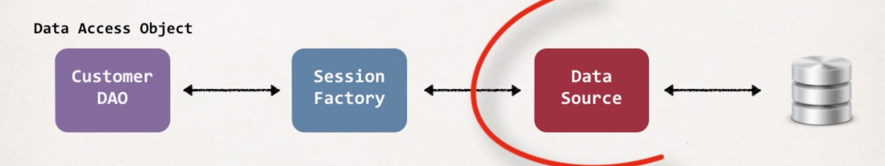

### Overview
- 지금까지 배운 Spring MVC와 hibernate를 결합해서 CRUD API를 만들어볼 것

### Data Access Object
- Controller는 DAO를 이용해서 디비와 통신한다.
- 이는 데이터 베이스와 통신을 하기 위한 helper/utility 클래스이다.

### DAO methods
- DAO는 CURD를 지원하기 위한 메서드들을 지원한다.
- saveCustomer
- getCustomer
- getCustomers
- updateCustomer
- deleteCustomer

### DAO, Session Factory
- DAO는 Hibernate를 사용하며, Hibernate Session을 통해서 디비와 통신한다.
- 복잡한 SQL 쿼리 처리 등은 hibernate 추상화를 이용하는 것이다.
- data source는 어떻게 디비와 통신하는 지를 정의하는 부분이다.
- 이 모든 것들은 dependency이다! 그리고 spring에서는 dependency injection을 통해서 이러한 문제를 해결한다.


### DAO dependency injection
- spring 설정 파일에서 이미 이러한 의존성 주입을 모두 완료했다.
- hibernate configuration 파일에서 정의하던 내용을 spring configfile에서 bean으로 정의한 것 뿐이다.
```
<bean>
  <property name="driverClass" value="com.mysql.jdbc.Driver" />
  <property name="jdbcUrl" value="jdbc:mysql://localhost:3306/web_customer_tracker?useSSL=false" />
</bean>
```
- SessionFactory는 DataSource에 의존한다. 마찬가지로 스프링 설정 파일에 bean으로 이러한 의존 관계를 설정해줄 수 있다.
```
<bean id="sessionFactory" class="org.springframework.orm.hibernate5.LocalSessionFactoryBean">
  <property name="dataSource" ref="myDataSource" />
</bean>
```

### DAO 만들기
- 먼저 DAO interface를 만들어준다.
```
public interface CustomerDAO {
  public List<Customer> getCustomers();
}
```
- 그 다음 인터페이스 구현체를 만든다.
```
public class CustomerDAOImpl implements CustomerDAO {
  @Autowired
  private SessionFactory sessionFactory;
  public List<Customer> getCustomers() {}
}
```
- @Autowired를 사용해서 스프링 설정 파일에 등록된 sessionFactory를 자동으로 찾아서 바인딩 한다.

