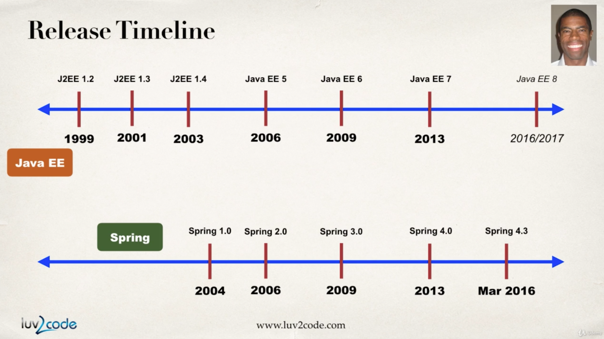

### Spring이란?
- 인기있는 자바 프레임워크
- simpler and lightweight alternative to J2EE
- 개발을 쉽게 만들어주는 helper 클래스들을 제공
- J2EE란 자바 기술로 기업 환경의 어플리케이션을 만드는데 필요한 스펙들을 모아둔 스펙 집합
- J2EE를 EJB 없이 개발할 수 있도록 도와주는 프레임워크가 Spring

- 초기 J2EE 1.2, 1.3, 1.4는 너무 복잡해서 도저히 쓸 수가 없었다. 그래서 Spring 1.0이 등장한 것이다.
- Java EE 7으로 넘어오면서 점점 코드를 개선하여 Spring의 특징들을 모두 사용할 수 있게 되었다. 그러나 이미 Spring이 이미 표준으로 자리잡았다.

### Spring 5
- 2017 Spring 5가 출시됨
- Java 8 or higher가 필요
- Deprecated legacy integration
- Spring MVC를 Servlet API 4.0가 사용 가능하게끔 업그레이드
- Spring WebFlux라는 새로운 reactive programming framework를 추가

### Spring framework
- Simplify Java Enterprise Development
- Spring Goals
  - Lightweight development with Java POJO
  - dependency injection to promote loose coupling
  - declarative programming with Aspect Oriented Programmign (AOP)
  - Minimize boilerplate Java code

### Spring 구성요소
- Core Container: Beans들을 만들어내며, bean의 의존성들을 관리함
  - Beans
  - Core
  - SpEL
  - Context
- Infrastructure: 로깅, 보안, 트랜젝션 등을 관리
  - AOP
  - Aspects
  - Instrumentation: 모니터링 기능을 제공, JMX(Java Management Extension)
  - Messaging
- Data Access Layer: 디비와 통신하는 부분
  - JDBC
  - ORM: Hibernate, JPA와 함께 사용
  - Transactions
  - OXM
  - JMS: Java Message Service, 비동기적으로 Message broker에게 메세지 전송
- Web Layer: Spring MVC 프레임워크의 기반
  - Servlet
  - WebSocket
  - Web
  - Portlet
- Test Layer: TDD 기능을 제공
  - Unit
  - Integration
  - Mock

### Spring Platform
- Spring 프레임워크 위에 올라가는 모듈들
- Spring Cloud, Spring Data, Spring Batch, Spring Security, Spring for Android, Spring WebFlow 등등등

### 개발환경 셋팅
- 톰 캣 설치하고 실행
- 이클립스 IDE를 사용
