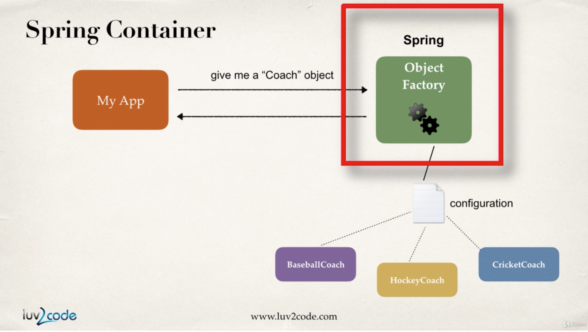

## 4장 Spring IoC
### IoC란?
- 객체의 생성과 관리를 아웃소싱하는 접근 방법
- outsource to an object factory

### Spring IoC
- object factory에 요청을 넣는다.
- object factory는 configuration에 맞는 객체를 맞들어서 리턴해준다.

- 객체를 만들고 관리한다. (Inversion of Control)
- 객체에 의존성을 주입한다. (Dependency Injection)

### Spring 컨테이너 설정하기
- xml (legacy)
- java annotation (modern)
- java source code (modern)

### Spring 개발 프로세스
- Spring Beans configure하기
- 스프링 컨테이너 만들기
- 스프링 컨테이너에서 빈즈 꺼내기

##### step1. sprint beans configure (ex. xml)
```
<beans>
  <bean id="myCoach"
        class="com.luv2code.springdemo.BaseballCoach">
  </bean>
</beans>
```

##### step2. create spring container
- 스프링 컨테이너는 ApplicationContext를 가리킨다.
- ClassPathXmlApplicationContext
- AnnotationConfigApplicationContext
- GenericWebApplicationContext
- others
```
ClassPathXmlApplicationContext context = new ClassPathXmlApplicationContext("applicationContext.xml")
```
##### step3 retrieve beans from container
```
Coach theCoach = context.getBean("myCoach", Coach.class);
```
- 즉, 팩토리를 만들어놓고 여기서 꺼내와서 쓴다!

### Spring Bean이란?
- spring에 의해서 만들어진 java object를 spring beans라 부른다.
- 컨텍스트를 만들고, xml로 미리 정의한 factory를 이용해서 bean을 만들어서 사용하고, 컨텍스트를 닫아주면 된다.

## 5장 Spring Dependency Injection
- dependency란 helper object로 이해하면 편하다.
- Spring에서는 객체를 만들기 위한 Factory가 있다. 이 Factory가 의존성 주입 문제도 해결해준다.
- Spring 컨테이너의 역할을 떠올려보면 먼저 객체의 생성과 관리를 담당하며 이를 IoC라 부른다. 그 다음 역할이 의존성 주입이다.

### injection types
- constructor injection
- setter injection

### Spring Dependency Injection 작업 순서
- 의존 interface와 class를 정의한다.
- injection을 위한 constructor를 추가한다.
- dependency injection을 Spring config 파일에 추가한다.

### Setter Injection
- setter method를 이용해서 dependency를 주입
- constructor 대신 setter 메서드를 작성하고, Spring Configfile을 작성하면 된다.
- configfile에 작성한 property name의 camelcase로 메서드 명을 작성해주어야 한다.
- 즉, 의존성을 생성자에서 주입하냐, setter에서 주입하냐 차이
```
<property name="fortuneService" ref="myFortuneService" />
public void setFortuneService(...)
```

### inject literal values
- setter method를 활용하여 주입이 가능 
- 마찬가지로 configfile을 수정해주어야 함
```
<property name="emailAddress" value="hello@naver.com" />
public void setTeam(String team) {
  this.team = team;
}
```

### inject values from properties file
- 주입하고 싶은 값들을 파일 형태로 담고 있고, 이를 그대로 주입하는 방법
- properties file을 생성한 다음 이를 Spring configfile에 추가해주면 된다.
- application xml 파일 안에서 properties 파일을 통째로 로딩한 다음, xml 파일 내에서 환경변수를 사용하듯 가져다 사용하면 된다.
```
<context:property-placeholder Location="classpath:sport.properties"/>
<property name="emailAddress" value="${foo.email}" />
```
