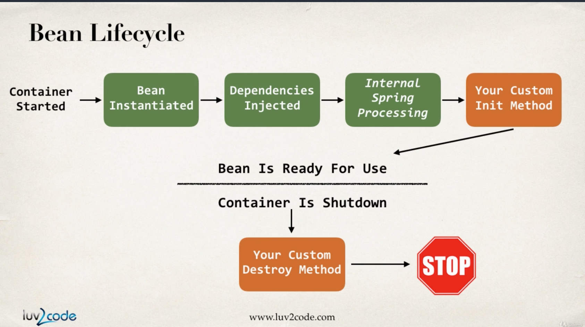

### Bean Scope
- default scope는 singleton이다. 해당 빈의 인스턴스는 하나만 생성하고, 이를 메모리 단에 캐시한다. 해당 빈에 대한 접근은 하나의 bean instance로 처리한다.
```
<bean id="myCoach" class="..." />
// scope를 명시적으로 추가할 수도 있다.
<bean id="myCoach" class="..." scope="singleton"/>
```
- 다른 scope로 아래와 같은 옵션들이 있다.
  - prototype: 요청때마다 새로운 인스턴스를 생성, stateful한 데이터를 담기에 적합하다.
  - request: web-app에서 사용
  - session: web-session에 사용
  - global-session: global web-session에 사용

### Bean lifecycle
- container started
- bean 초기화
- dependency injected
- internal spring processing
- custom init method
- 이 때부터 bean이 ready for use
- Container shutdown-> custom

- 오렌지 박스 영역이 개발자가 직접 코드를 작성할 수 있는 영역
- 초기화에서는 db 연결, 소켓 연결, 파일 로딩 등을 수행
- 파괴자에서는 db 연결해지, 소켓 연결 해지 등을 수행
```
<bean>
 init-method="custom init method"
 destroy-method="custom destroy method"
</bean>
```
