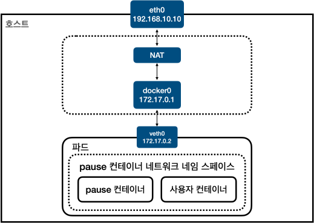

### 도커 컨테이너 브릿지 타입 네트워킹

- 각 컨테이너 별로 네트워크 네임 스페이스를 형성한다.
- 네임 스페이스별로 별도의 라우팅 테이블, ARP, ip table을 관리한다.
- 호스트 네임스페이스 아래에는 NAT과 브릿지가 위치한다. 브릿지의 이름은 보통 doker0이다.
- 각 네임스페이스는 veth라는 가상 회선을 통해서 호스트 네임 스페이스의 브릿지와 연결된다.
- 브릿지는 NAT과 연결되며, NAT은 다시 호스트의 네트워크 인터페이스인 eth0와 연결된다.
- 즉, 각 컨테이너 네임 스페이스는 veth를 통해서 브릿지로 연결되고, 이는 다시 NAT을 통해 호스트의 eth0에 연결됨으로써 외부 네트워크와 통신이 가능해진다.

### 도커 컨테이너 네트워킹 종류
- 브리지: 호스트에 브리지를 만들고, 컨테이너와 호스트는 베스를 이용해서 연결
- 오버레이: 여러대 호스트가 있을 때 각 호스트에 있는 컨테이너 네트워크를 오버레이 네트워크로 연결시킴. 도커 스웜에서 기본 네트워크로 사용
- 맥브이랜: 이더넷 장치 하나에 여러개 가상 MAC 주소를 할당하는 기술. 컨테이너 MAC 주소와 IP를 할당
- 호스트: 컨테이너 네트워크 네임스페이스 대신 호스트의 네트워크 네임스페이스를 직접 사용
- 링크 타입: 이미 생성되어 있는 네트워크 네임스페이스에 컨테이너를 연결, 쿠버네티스 네트워크의 기본

### 파드 네트워킹

- 파드는 기본적으로 puase라는 컨테이너와 사용자 컨테이너들의 그룹을 말함
- 파드에 속한 컨테이너들은 동일한 IP를 가짐
- 컨테이너들은 쿠버네티스가 미리 생성한 puase 네트워크 네임 스페이스에 속함
- 파드에 속한 컨테이너들은 veth0 하나를 공유하게 되며 이는 도커 네트워크 타입 중 링크를 사용해 구현됨
- pause 컨테이너는 파드의 기반이 되며 이를 인프라 컨테이너라 부름. 쿠버네티스가 생성하고 관리

### CNI 기반 멀티노드 파드 네트워킹
