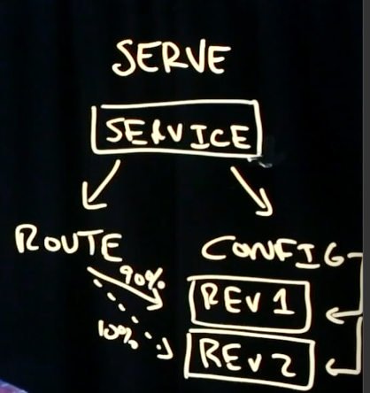

### Knative의 구성 요소
- build
- serve
- event

### Knative build
- 쿠버네티스에서 애플리케이션을 배포하기 위해서는 먼저 소스 코드가 있어야하며 이를 도커 컨테이너로 빌드해야 한다.
- 빌드 된 도커 이미지는 클라우드 저장소로 푸쉬된다.
- 쿠버네티스 클러스터 내에서 이미지를 다운로드 받아서 돌리게 된다.
- 쿠버네티스 클러스터 내로 이 모든 과정을 끌고 올 수는 없을까? 이를 가능케 해주는 것이 knative build

### knative serve
- istio는 traffic routing, intelligent routing, automatic scaling, scale to 0 등을 지원한다.
- service(micro service)가 route와 config를 가리킨다. service는 모든 버젼에 대한 기록을 남긴다. rev1, rev2 등을 config아래에 기록을 남긴다.
- route는 90%의 트래픽을 rev1에, 10%의 트래픽을 rev2에 보내줄 수 있으며, 카나리 배포를 구현할 수 있다.

### knative event
- trigger를 구현할 수 있다.
- pipeline을 만들 수 있다.
