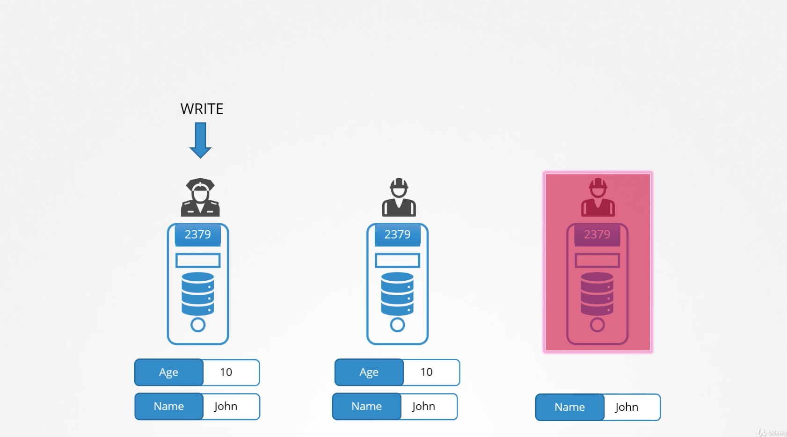
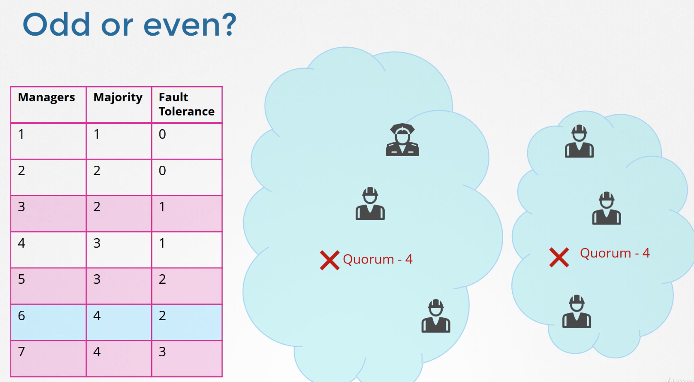

### Cluster 디자인하기
- 클러스터의 목적은?
- 어떤 애플리케이션을 돌릴 것인가?
- 몇 명이 사용할 것인가?
- 어떤 유형의 트래픽이 발생할 것인가 등등
- production level 클러스터를 만든다면?
  - 고가용성을 고려해야함
  - kubeadm나 GCP,AWS도 좋은 옵션

### Cloud or OnPrem?
- on-prem 시에는 kubeadm 좋다.
- GKE, Kops, AKS 좋다.
- 저장소 설계시에는 SSD Backend Storage 좋다.

### Master Node
- 마스터 노드를 여러대 운영하며 ETCD도 마스터 노드에서 분리시킨 다음 클러스터로 운영한다.

### Choosing Kubernetes Infrastructure
- 랩탑에 설치시에 만일 OS가 리눅스라면 바이너리를 받아서 그냥 실행하면 된다.
- kubeadm, minikube가 좋은 선택이다.
- Turnkey Solution
  - 직접 VM 프로비젼
  - 직접 VM 설정
  - 클러스터 배포를 위해 스크립트 ㅏ숑
  - VM을 직접 운영
  - KOPS를 사용해서 AWS 상에서 kubernetes를 운영하는 경우
- Hosted Solution(Managed Solutions)
  - Kubernetes as a Service
  - Provider provisions VMs
  - Provider installs Kubernetes
  - Provider maintains VMs
  - GKE를 사용하는 경우

### Turnkey Solutions 예시
- opensift, Cloud Foundry Container Runtime, VMware Cloud PKS, Vagrant -> kubernetes를 배포하기 쉽도록 도와주는 도구들

### Multi Master
- 멀티 마스터에서는 로드 밸런서를 통해서 여러 대의 마스터 노드의 kube-apiserver에 트래픽을 분산시킨다.
- kube-controller-manager --leader-elect true 옵션을 주면 여러 대의 마스터 노드 안에서 동작중인 kube-controller-manager에서 리더를 선택한다. 리더는 Active모드가 되며 나머지는 Standby 상태가 된다.
- 만일 리더 프로세스가 크래쉬가 나면 다른 마스터의 프로세스가 리더가 되며 Active 상태가 된다.
- ETCD는 2가지 topology가 있다.
  - Stacked Topology: ETCD가 마스터 노드 안에서 동작한다.
  - External ETCD Topology: ETCD가 별도의 노드에서 동작한다. 더 안정성이 높아지는 반면에 설치나 셋팅이 까다롭고 추가적인 리소스가 필요하다.

### ETCD in High Availability
- ETCD: distributed reliable key-value store taht is simple, secure and fast
- 일관성을 유지하기 위해서 오직 하나의 리더 노드만 write를 수행할 수 있도록 한다.
- 다른 노드에 들어온 write 요청은 리더 노드에게 전달되고, 리더 노드가 write 작업을 수행한 다음, 해당 데이터를 나머지 노드들이 복사해 감으로써 일관성이 유지된다.
- ETCD는 리더 노드 선출에 RAFT라는 알고리즘을 적용한다.

### ETCD RAFT
- 각각의 노드에서 랜덤 타이머를 실행시킨다.
- 가장 먼저 타이머가 종료된 노드가 다른 노드들에게 요청을 보낸다. 나머지 노드들이 동의한다는 리스폰스를 보내면 리더로 선출된다. 리더는 자신이 리더로 선출되었음을 나머지 노드들에게 알려준다.
- 만일 리더로부터 알림이 오지 않는다면 나머지 노드끼리 다시 투표 과정을 거쳐서 리더를 선출한다.

### ETCD write

- 리더 노드가 쓰기작업을 수행하고 이를 다른 노드들에게 복사한다.
- 이 때 특정 노드가 동작하지 않을 수 있다.
- 이런 상황에서 ETCD는 절반 이상의 노드들에 데이터를 썼다면 쓰기 작업이 성공했다고 여긴다. 이 절반 이상의 노드 수를 Quorum이라 부른다.
```
Quorum = (N//2) + 1
ex) node=6, quorum=4
fault tolerance = node - quorum
```
- 마스터 노드 개수 선택 시에는 홀수개를 선택할 것을 권장한다.
- 네트워크 파티션을 나눌 경우 마스터 노드를 짝수개로 설정할 경우 Quorum을 만족시키지 못하는 상황이 발생할 수 있다.

- 즉, 6개보단 5개가 권장되며, 5개 이상은 그다지 필요하지 않다.

### ETCDCTL
- etclctl 명령어로 데이를 저장하고 읽을 수 있다.
