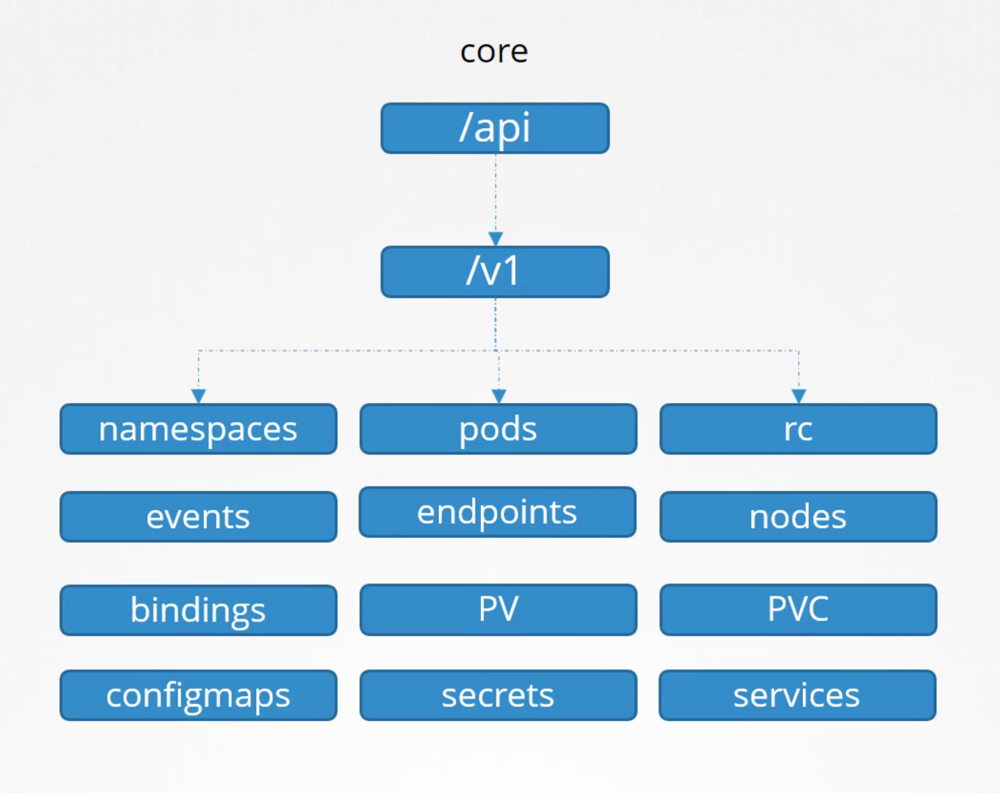

### API Groups
- master node의 주소로 kube-apiserver에 접속이 가능하다.
- master-node-ip:6443/api url로 kube-apiserver의 기능들을 쓸 수 있다.
- 그 외에도 /metrics, /healthz, /version, /apis, /logs 등이 있다.

### /api, /apis
- api: core, apis: named
- core: namespaces, pods, rc, events, endpoints, nodes, bindings, pv, pvc, configmaps, secrets ,services
- named: /apps, /extensions,/networking.k8s.io, /storage.k8s.io, /authentication.k8s.io, /certificates.k8s.io


- named의 가장 상위 url을 api group이라 부르고 그 아래로 버전, 리소스라 부른다.
- 각각의 리소스 url은 list, get, create, delete, update 등의 동작을 수행할 수 있다.

### kubectl proxy
- kube-proxy와 다르다.
- kubectl이 kube-apiserver에 접속하기 위해서 사용함

### RBAC
```
apiVersion: rbac.authorization.k8s.io/v1
kind: Role
metadata:
  name: developer
rules:
- apiGroups: [""]
  resources: ["pods"]
  verts: ["list", "get", "create", "update", "delete"]
- apiGroups: [""]
  resources: ["ConfigMap"]
  verbs: ["create"]
```
```
apiVersion: rbac.authorization.k8s.io/v1
kind: RoleBinding
metadata:
  name: devuser-developer-binding
subjects:
- kind: User
  name: dev-User
  api
roleRef:
  kind: Role
  name: developer
  apiGroup: rbac.authorization.k8s.io
```
### Check Access
```bash
$ kubectl auth can-i create deployments
>> yes or no
$ kubectl auth can-i create deployments --as dev-user
>> yes or no
$ kubectl auth can-i create deployments --as dev-user --namespace test
>> yes or no
```
### Resource Names
- resourcesNames로 파드별로 접근 권한을 다룰 수도 있다.

### Role, ClusterRole
- namespace를 지정해서 생성되는 리소스들이 있다. pods, replicasets, jobs, deployments, services, secrets, roles, rolebindings, configmaps, pvc가 그러하다.
- namespace에 상관없이 클러스터 차원에서 정의되는 리소스들이 있다. nodes, pv, clusterroles, clusterrolebindings, certificatesigningrequests, namespaces들이 그러하다.
- 클러스터 차원에서 role을 정의하고 유저에 binding 시키려면 clusterrole과 clusterrolebindign을 사용한다.
