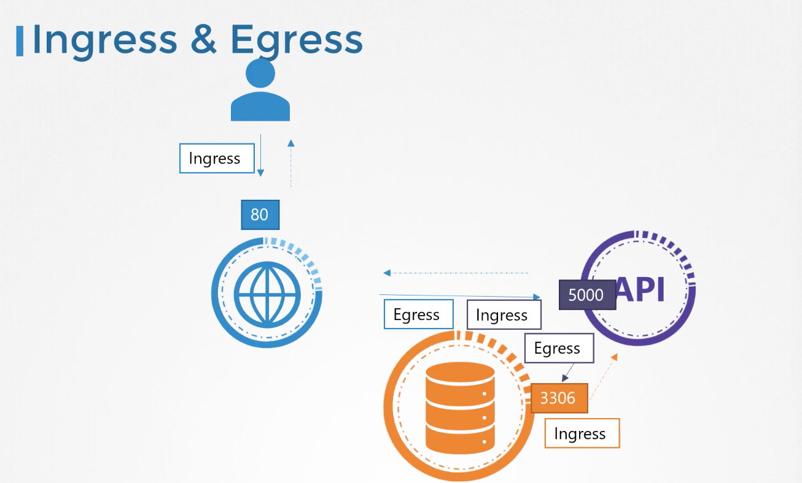

### Kubernetes Security
- 파드 레벨에서 보안 설정을 하면 파드 내 모든 컨테이너에 적용됨
```
spec:
  securityContext:
    runAsUser: 1000
  containers:
  ...
```
```
spec:
  containers:
  - name: ubuntu
    securityContext:
      runAsUser: 1000
  ...
```
### Traffic이란?
- ingress: 안으로 들어오는 트래픽
- egress: 밖으로 나가는 트래픽


### Network Security
- 쿠버네티스는 기본적으로 클러스터 내부의 파드 간의 통신은 모두 허용하는 방식으로 동작한다.
- 만약 프런트엔드 파드가 디비 파드에 직접 붙지 못하도록 하고 싶다면?
- 여기서 Network Policy가 필요한 부분이다.
- 파드에 Network Policy를 붙일 수 있다. 이는 특정 포트로 들어오는 트래픽만 수신하는 등의 작업을 수행할 수 있다.
- Selector를 통해서 이러한 NetPolicy를 구현할 수 있다.
```
labels:
  role: db
```
### Network Policy - Rules
```
apiVersion: networking.k8s.i/v1
kind: NetworkPolicy
metadata:
  name: db-policy
spec:
  podSelector:
    matchLabels:
      role: db
  policyTypes:
  - Ingress
  ingress:
  - from:
    - podSelector:
        matchLabels:
          name: api-pod
    ports:
    - protocol: TCP
      port: 3306
```
- from:
    - podSelector:
        matchLabels:
          name: internal
    ports:
    - port: 8080
      protocol: TCP

- to:
  - podSelector:
      matchLabels:
        name: mysql
  ports:
  - port: 3006
    protocol: TCP
