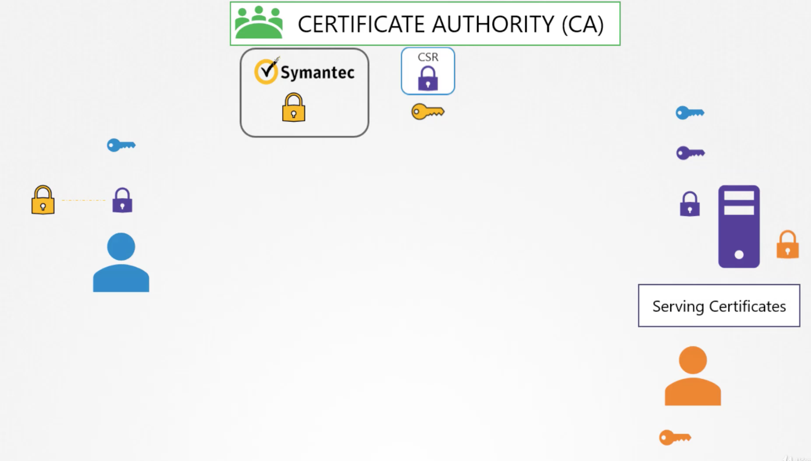

### TLS basics
- id, password를 평문 그대로 서버로 전송하면 중간에 낚아채기 쉽다. 그러므로 암호화가 필요하다.
- 대칭키 암호화: 암호화와 복호화에 동일한 키를 사용하는 방식, 네트워크를 통해서 키 값 역시 전송해야하는 취약점이 있다.
- 비대칭 암호화: 암호화에 사용하는 키와 복호화에 사용하는 키가 다르다. 암호화에는 공개키를 사용하고 복호화에 개인키를 사용한다.

### SSH
- public, private 키 페어를 생성하면 id_rsa, id_rsa.pub가 생성된다.
- 그 다음 서버에 공개키를 전달하며, 이는 서버의 ~/.ssh/authorized_keys 아래에 저장이 된다.
- 서버는 자신의 public key와 private key를 쥐고 있다.
- 사용자는 먼저 서버의 public key로 대칭키를 암호화해서 서버에 전송한다.
- 그러면 중간에 낚아채더라도 서버의 private key가 없으므로 해독하지 못한다.
- 서버는 전달된 메세지를 자신의 private key로 해독하여 대칭키를 안전하게 전달받는다.
- 즉, 비대칭키를 이용하여 대칭키를 주고 받음으로써 안전하게 암호화 통신을 수행할 수 있다.

### CA의 필요성
- 해커가 만일 은행과 굉장히 유사한 사이트를 차려놓고, 해당 서버에 자신의 public key와 private key를 설정할 경우 우리는 대칭키를 영략없이 탈취당하게 된다.
- 이 때, 서버의 공개키가 신뢰할만한 것인지를 인증해주는 것이 certificate이다. 인증 기관이 직접 신뢰할 수 있는 인증서인지를 보증해주는 역할을 수행
- 내가 스스로 인증서에 서명을 하면 이를 self signed certificate라 부르며 이는 신뢰할 수 없다.
- 인증서를 만들고, 공증 기관의 싸인을 받는 개념, 공증 기관이 인증서의 내용이 적절한 지를 검증하게 된다.
- 브라우저는 CA가 적절한 기관인지 검증하는 기능이 있다.
  - 각 CA 기관들도 public key와 private key가 있으며, 브라우저에 CA의 public key가 탑재되어 있다.

### CA를 통한 암호화 통신
- 서버는 public key와 private key를 생성한다.
- CA에 서버의 공개키를 전달, 서버의 공개키는 CA의 private key로 암호화
- 유저가 웹 서버에 접근 시에 서버는 CA 개인키로 암호화된 서버의 공개키를 전달한다.
- 유저의 브라우저에 탑재된 CA의 공개키로 인증서가 유효한 인증서인지를 검증하며, 유효할 경우 서버의 공개키를 획득한다.
- 서버의 공개키로 유저의 개인키를 암호화해서 전달한다.
- 서버는 안전하게 유저의 개인키를 수신할 수 있으며, 이를 통해서 암호화 통신을 수행할 수 있다.

### PKI
- 이런 인증 과정에 관련된 모든 인프라를 Public Key Infrastructure라 부른다.

### 네이밍 컨벤션
- 공개키는 pem, crt로 사용함. server.crt, server.pem 등
- 개인키는 key, -key.pem을 사용함
- csr: Certificate Signing Request, CA의 인증을 받지 못한 공개키 
- crt: Certificate 줄임말, CA의 싸인을 포함한 공개키

### 정리
- 서버는 공개키와 개인키를 가지며, 이 공개키는 아직 CA의 싸인을 받지 못한 상태이므로 csr이다.
- 서버는 CA에 자신의 csr을 전송한다. CA는 자신의 개인키로 csr에 서명해서 서버에 전송하며, 이 서명이 담긴 공개키를 crt라 부른다.
- 클라이언트는 서버의 crt를 수신한다. 브라우저에 탑재된 CA의 공개키로 crt에 기재된 인증 기관이 유효한지 확인한 다음, 서버의 공개키를 획득한다.
- 클라이언트는 대칭키를 서버의 공개키로 암호화해서 서버에 전송하며, 서버는 자신의 개인키로 복호화해서 대칭키를 획득한다.
- 그 결과로 클라이언트와 서버는 안전하게 대칭키를 주고 받았으며, 이를 통해 보안 통신을 할 수 있게 된다.
- 참고자료: https://www.udemy.com/course/certified-kubernetes-administrator-with-practice-tests/learn/lecture/14296090#questions

