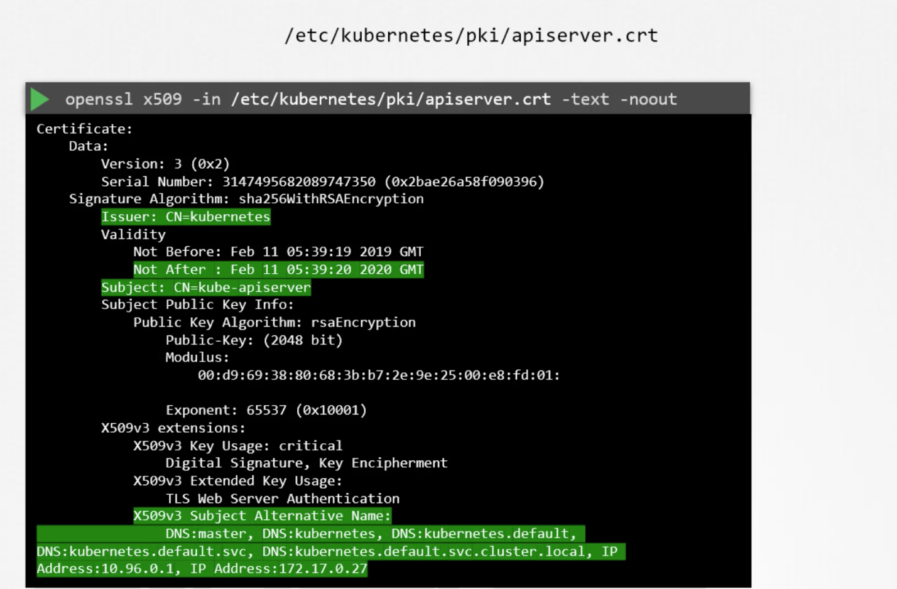
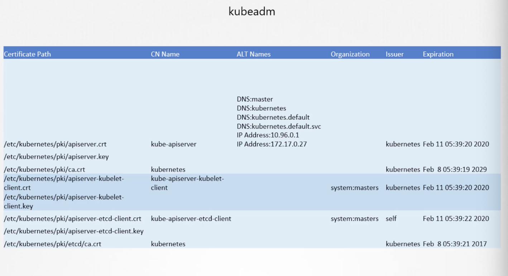

### TLS details
- 새로운 팀에 조인해서 쿠버네티스 클러스터 구성을 파악해야하는 상황이라면 어떻게 하겠는가?
- 먼저 클러스터가 어떻게 구성되었는 지를 확인해야한다.
- 가장 어려운 방법으로는 직접 셋팅하는 것이며, 이 때 직접 인증서들을 생성해서 집어넣어주는 과정을 거친다.
- kubeadm 같은 툴을 사용하면 인증서 생성 과정을 자동으로 진행해준다.
- 즉, 클러스터를 구성하는 방법에 따라서 인증서 정보가 담겨있는 위치가 다르다.
- 여기서는 kubeadm을 사용한 경우를 살펴본다.

### certificate detail 살펴보기
```bash
$ openssl x509 -in /etc/kubernetes/pki/apiserver.crt -text -noout
```
- 여기서 인증서의 이름과 alias, issuer, 만료 기간 등을 살펴볼 수 있다.



### View Logs
```bash
// OS 로그 확인해서 tls가 정상 작동 중인지 확인 가능
$ journalctl -u etcd.service -l
```
- 떄떄로 kube-apiserver가 먹통이 될 떄가 있다. 이 때는 한 레벨 아래로 내려가서 docker의 로그를 확인하면 된다.
```bash
$ docker ps -a
$ docker logs <containerID>
```

### 연습문제
```
/etc/kubernetes/pki/apiserver-etcd-client.crt
-> etcd 서버가 apiserver를 인증할 때 사용되어지는 키
```
```
$ openssl x509 -in /etc/kubernetes/pki/apiserver.crt -text -noout
```
- 인증서 세부 내용 확인
- Subject: 해당 인증서에 설정된 Common Name, CN
- Issuer: 발급자

- ETCD는 자체 CA를 쓴다. 먼저 ETCD server certificate를 확인한 뒤, apisever yaml에 맞게 설정되어 있는지를 확인한다.
