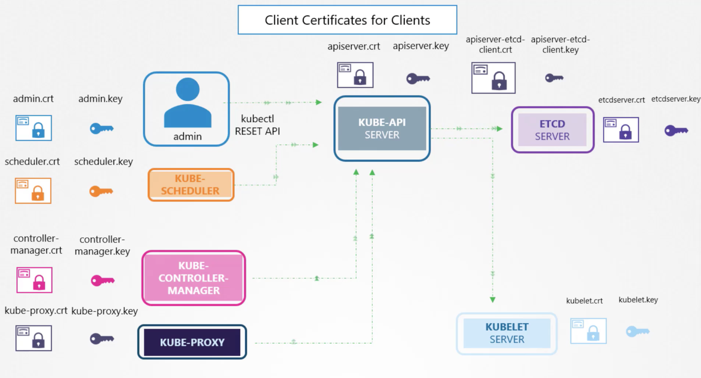

### 쿠버네티스 클러스터 내 인증서 종류

- 먼저 kube-apiserver와 통신하는 컴포넌트들의 인증서들이 있으며, admin user, kube-scheduler, kube-controller-manager, kube-proxy들의 인증서가 여기에 해당한다. Client Certificate for Client라 부른다.
- 그 다음 kube-apiserver가 etcd, kubelet들과 보안 통신을 하기 위한 인증서들과, etcd, kubelet 측의 인증서가 있으며, 이 역시 Client Certificate for Client에 속한다.
- Server Certificates for Server는 서버 측 인증서를 말하며 etcd server, kube-apiserver, kubelet sever의 서버측 인증서를 의미한다.

### CA in kubernetes

- CA가 유효한지 인증하기 위해서는 브라우저에 CA의 공개키가 내장되어 있어야한다.
- 쿠버네티스 클러스터 내부에서 CA가 유효한지 확인하기 위해서는 마찬가지로 CA의 공개키가 모든 컴포넌트들에 공유되어 있어야 한다.
- 그래야만 CA로 서명한 인증서가 유효한지를 검증할 수 있다.

### 쿠버네티스에서의 tls
- 세 종류의 인증서들이 있다.
  - Server Certificates
  - CA Certificates
  - Client Certificates
- .crt, .pem은 공개키, .key, -key.pem은 개인키

### 쿠버네티스에서 암호화가 필요한 이유
- 쿠버네티스 클라이언트는 마스터 노드와 워커 노드들로 구성되어 있다.
- 클라이언트와 kube-apiserver 간의 통신, 서버들 간의 통신 모두 보안이 확보되어야 한다.
- 그러므로 서버 인증서, 클라이언트 인증서가 모두 필요하다.

### Server Certificates for Servers
- kube-apiserver: apiserver.crt, apiserver.key
- etcd-server: etcdserver.crt, etcdserver.key
- kubelet: kubelet.crt, kubelet.key
- kube-apiserver과 통신 하는 모든 주체들은 자신만의 crt, key 파일을 가지고 스스로를 인증한다.


### Certificate 만들기
1. CA의 개인키 만들기 -> ca.key 생성
2. 개인키로 공개키 만들기 -> ca.csr 생성
3. 자신의 공개키에 자신의 개인키로 서명하기 -> ca.crt 생성, 이를 self signed key라 부름
```bash
$ openssl genrsa -out ca.key 2048
>> ca.key
$ openssl req -new -key ca.key -subj "/CN=KUBERNETES-CA" -out ca.csr
>> ca.csr
openssl x509 -req -in ca.csr -signkey ca.key -out ca.crt
>> ca.crt
```
- 여기서 생성된 ca.key와 ca.crt를 가지고 쿠버네티스 내의 나머지 컴포넌트들의 인증서들을 싸인하고 보안 통신을 하는 방식이다.
 
### Admin User
- 마찬가지 방식으로 key 생성, csr 생성, CA 싸인 받아서 crt 생성 방식으로 진행하며, 이 때 앞서 만든 CA를 사용한다.
```bash
$ openssl genrsa -out admin.key 2048
>> admin.key
$ openssl req -new -key admin.key -sub "/CN=kube-admin" -out admin.csr
>> admin.csr
$ openssl x509 -req -in admin.csr -CA ca.crt -CAkey ca.key -out admin.crt
>> admin.crt
```
- CA 서명 받을 때에는 CAkey 값으로 ca.key(개인키)를 사용한다. 그리고 CA에는 ca.crt를 기입해준다.
- Admin user를 다른 유저와 구분하기 위해서 group을 csr 생성 과정에서 설정해준다.
```bash
$ openssl req -new -key admin.key -subj "/CN=kube-admin/O=system:masters" -out admin.csr
```
- kube-apiserver에 접속하는 모든 컴포넌트 (kube-scheduelr, kube-proxy, kube-controller-manager)의 인증서를 같은 방식으로 생성할 수 있다.

### ETCD Server Certificate
- ETCD는 클러스터로 배포될 수 있다. 이 경우 ETCD 인스턴스들 간에 암호 통신을 해야하며, 별도의 인증서가 필요하다.
- ETCD 설정할 때 옵션 값으로 인증서들을 넣어주는 것은 바로 이 이유 때문이다.

### kube-apiserver Certificate
- crt, key 생성
- 모든 컴포넌트들이 apiserver와 통신하려 한다. kubernetes, kuberntes.default, kubernetes.default.svc, kubernetes.default.scv.cluster.local, internal IP, external IP 등등 많은 이름으로 불릴 수 있다.
- 이러한 alias들을 모두 인증서에 적어주어야만 한다.
```bash
$ openssl genrsa -out apiserver.key 2048
$ openssl req -new apiserver.key -subj "/CN=kube-apiserver" -out apiserver.csr -config openssl.cnf
>> 그 다음 openssl.cnf 파일에서[alt names] 아래에 alias 들을 적어준다.
```
### Kubelet Server
- kubelet은 각 노드별로 하나씩 떠있다.
- 각 kubelet의 인증서에는 노드 이름을 적어준다. ex) system:node:node01

