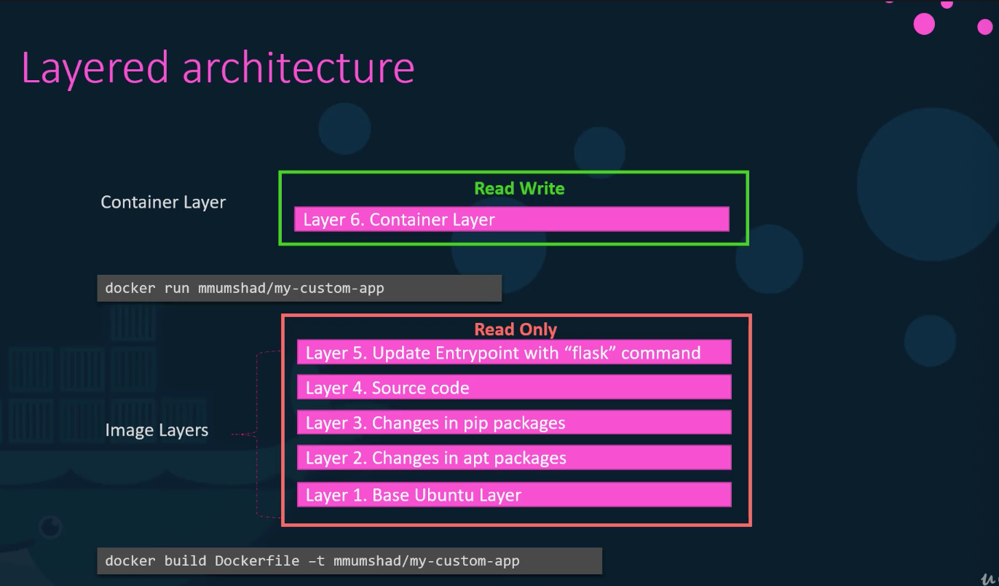
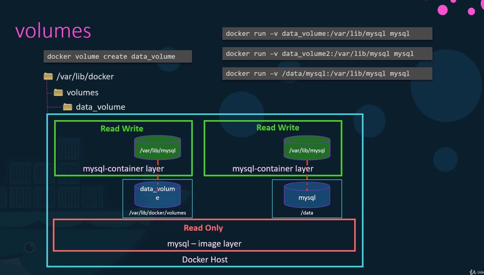
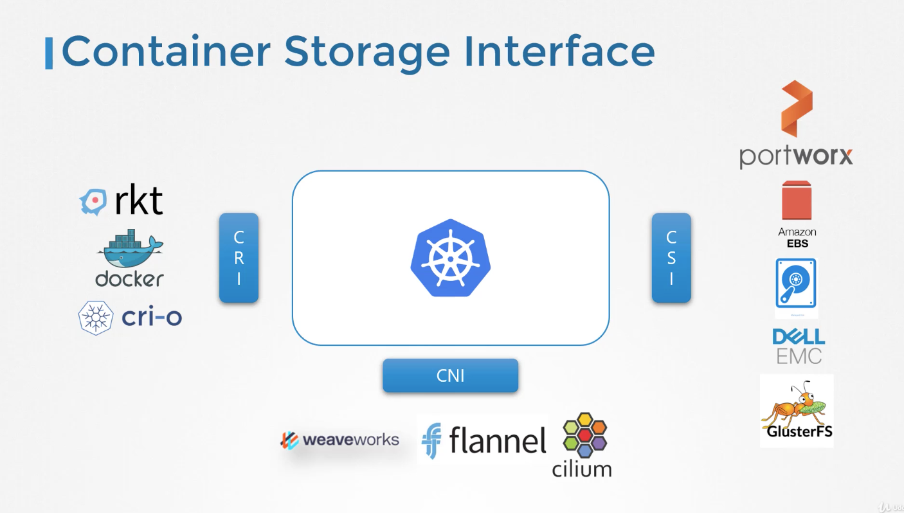

### docker storage
- /var/lib/docker
  - aufs
  - containers
  - images
  - volumes

### Docker Layered Architecture
- dockerfile의 각 단계는 하나의 레이어에 해당한다.
- 만일 이전에 동일한 단계를 수행한 적이 있다면 이를 캐시로 활용할 수 있다.
- 사실 각 단계별로 임시 컨테이너를 만들고, 그 안에 파일 시스템에 각종 작업을 수행하고, 이 파일 시스템의 스냅샷을 뜨는 것이다.
- 이미지 빌드하는 단계까지를 image layer, 컨테이너로 띄운 단계를 container layer라 부른다.

- 이미지 내부의 파일은 readonly라서 컨테이너에서 수정하는 것이 불가하다.
- 컨테이너에서 이미지의 파일을 수정하는 것은 이미지 내부 파일의 카피본을 수정하는 것이며 이를 COPY-ON-WRITE라 부른다.
- 컨테이너를 삭제하면 컨테이너에서 작성하거나 수정한 내용이 사라진다.
- 컨테이너가 사라지더라도 데이터를 남기고 싶다면 volume을 써야한다.

### Docker volumes
- 도커 볼륨에는 volume mounting과 binding mounting이 있다.
- volume mounting은 도커 명령어로 /var/lib/docker/volumes 아래에 볼륨을 생성해놓고 이를 컨테이너에 마운팅하는 것이다.
- bind mounting은 기존 파일 시스템에 존재하는 폴더를 그대로 컨테이너에 마운팅 시키는 것이다.

- -v 옵션으로 볼륨을 설정하는 것 보다 --mount가 더 최신의 방법이다.
```bash
$ docker run --mount type=bind, source=/data/mysql,target=/var/lib/mysql mysql 
```
- 이 모든 작업을 storage driver가 담당하며 AUFS, ZFS, BTRFS, DEVICE MAPPER, OVERLAY 등등이 있다. 도커는 OS에 따라서 최적의 storage driver를 자동으로 선택한다.

### Volume Drivers
- Local, Azure File Storage, Convoy, DigitalOcean 등등 클라우드 제공자 별로 다양한 솔루션들이 있다.
- volume driver를 통해서 클라우드 상의 저장 공간이 쿠버네티스 클러스터에 마운트 되고 이를 통해서 볼륨의 활용이 가능하다.

### Container Storage Interface(CSI)

- kubernetes는 CRI(Container Runtime Interface), CNI(Container Networking Interface), CSI(Container Storage Interface) 등 여러 인터페이스를 갖고 있다.
- 이들 인터페이스는 쿠버네티스 뿐만 아니라 다른 오케스트레이션 툴들에도 적용된다.
- 이런 인터페이스를 통해서 써드 파티 플러그인들이 쉽게 개발될 수 있게끔 지원한다.
- 그중에서 Storage 부분을 담당하는 인터페이스가 CSI이다.
