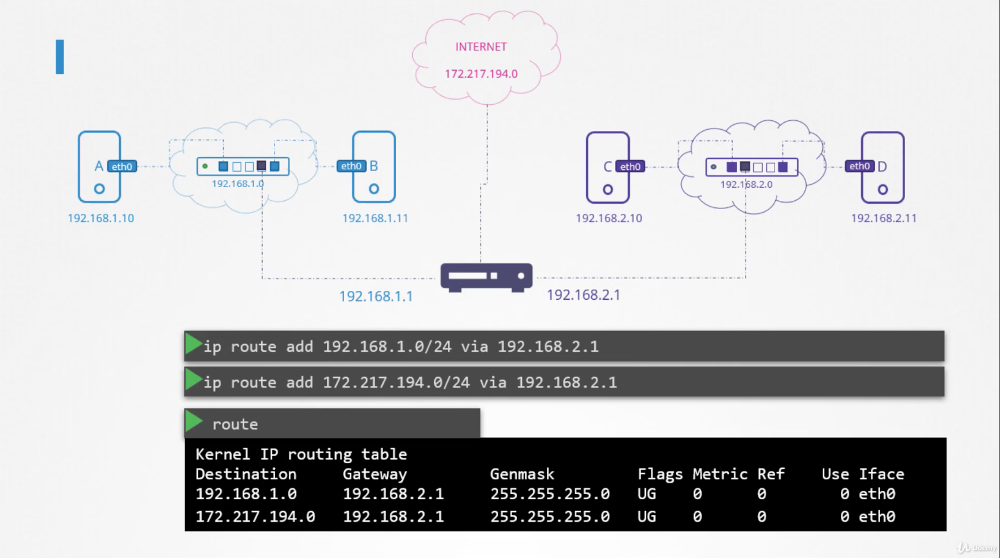

### Switching
- A, B 컴퓨터가 있다. 스위치를 사용해서 이 둘을 연결하는 것이다.
- 스위치는 네트워크 안의 노드들 간의 데이저 전송을 매개해주는 장비이다.
- 각 컴퓨터를 스위치에 등록해주고 IP를 할당받으면 스위치를 통해서 두 컴퓨터가 통신을 할 수 있게 된다.
```bash
$ ip addr add 192.168.1.10/24 dev eth0 // eth0에 스위치로 연결되는 ip 192.168.1.10을 할당해주겠다는 소리
```


### 네트워크 간 통신
- 네트워크와 네트워크 간의 통신은 라우터를 통해서 이루어진다.
- 라우터는 네트워크들을 이어주므로, 각 네트워크의 IP를 모두 할당 받는다.
- 라우터도 네트워크를 구성하는 하나의 장비일 뿐이다. 때문에 게이트웨가 필요하다.
```bash
$ route // 현재 라우팅 테이블을 보여준다.
```
- 라우팅 테이블이 비어있는 상태에서는 네트워크 간에 통신이 불가능하다.
```bash
$ ip route add 192.168.2.0/24 via 192.168.1.1
```

- 라우팅 테이블에 특정 네트워크로 진입하려면 어느 IP를 통해야 한다라고 명시를 해주어야 한다.
- 인터넷에 접속할 시에도 마찬가지로 특정 인터넷 네트워크로 들어가기 위해서 라우터의 어떤 IP를 통과해야하는 지를 명시해준다.
- 명시가 되어있지 않은 경우에는 무조건 이 아이피를 통과하라는 default를 줄 수도 있다.


### 주요 명령어
```bash
$ ip link
$ ip addr
$ ip addr add 192.168.1.10/24 dev eth0
$ ip route
$ ip route add 192.168.1.0/24 via 
```

### Linux Host를 라우터로 쓰기

- 아무 설정 없이 A에서 C로 통신하려 하면 network is unreachable 에러가 발생한다.
- A에게는 host B를 통해서 C로 접속해야 한다고 알려줘야 한다.
- 마찬가지로 C가 응답을 보내줘야 하므로 host B를 통해 A로 접속해야 한다고 알려줘야 한다.
```bash
$ ip route add 192.168.2.0/24 via 192.168.1.6
$ ip route add 192.168.1.0/24 via 192.168.2.6
```
- 라우팅 설정은 잘 마쳤지만 이 상태에서는 통신이 안된다. 왜? 리눅스가 보안 상의 이유로 hostB에서 eth0와 eth1 간의 패킷 전달을 막기 때문. 그러므로 패킷 포워딩을 열어주어야 한다.
```bash
$ cat /proc/sys/net/ipv4/ip_forward
>> 0 //forward 못하도록 default
$ echo 1 > /proc/sys/net/ipv4/ip_forward // 임시 개방
// 영구 설정을 하고 싶다면 /etc/sysctl.conf 수정을 해야함
```

### Take Aways
```
$ ip link
$ ip addr
$ ip addr add 192.168.1.10/24 dev eth0
$ ip route // 라우팅 테이블 조회
$ ip route add 192.168.1.0/24/ via 192.168.2.1
$ cat /proc/sys/net/ipv4/ip_forward
```
