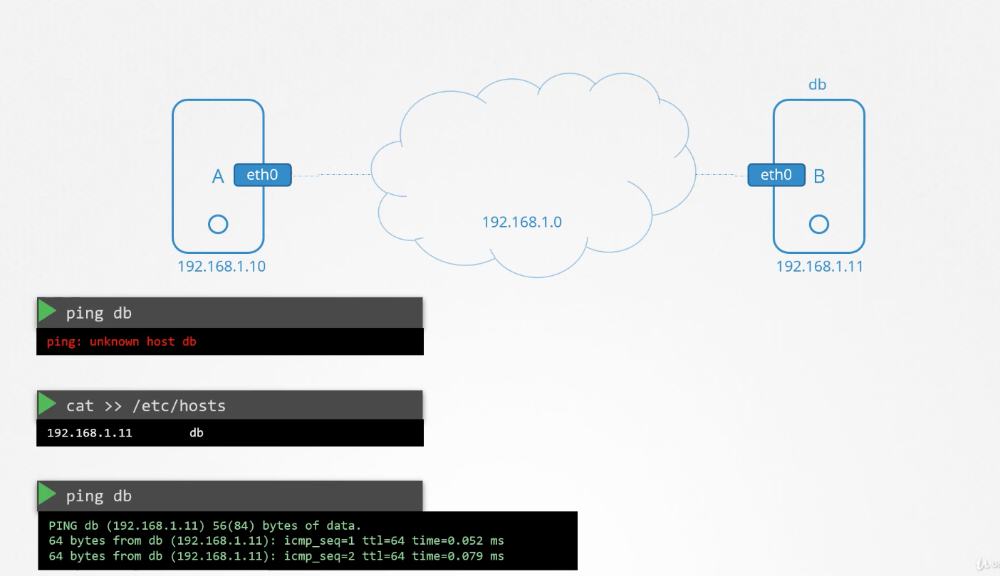

### DNS 기본 개념
- 도메인 이름과 IP를 변환해주는 역할이 필요하다.
- 그냥 클라이언트에 도메인 이름에 해당하는 IP 주소를 넣어주는 것으로도 가능하다.

### DNS Server
- 모든 개별 호스트에서 이러한 도메인 네임 - IP 매핑 정보를 입력해주는 것인 비효율 적이다. 이러한 정보만 모아놓은 서버를 DNS 서버라고 부른다.
- /etc/resolv.conf 안에 nameserver 192.168.1.100 이렇게 네임 서버의 주소가 담겨져 있다.
- 따라서 도메인 이름으로 다른 호스트와 통신을 하고 싶다면 먼저 네임 서버에 들러서 도메인 이름에 해당하는 IP 주소를 가져온 다음, 그 IP 주소로 통신을 하게 되는 것이다.
- 도메인 이름 사용시에 먼저 /etc/hosts를 훑어보고 /etc/resolv.conf에 기재된 nameserver를 훑어본다.

### Domain Names
- .com, .net, .edu 등 다양한 도메인이름이 있으며, 이를 기준으로 도메인들을 그루핑할 수 있다.
- www.google.com을 찾는다고 한다면 역순으로 ., .com, google 순으로 찾는다.
- 그 다음 google 아래서 mail, drive, apps 등등으로 갈라지게 된다.
- DNS 서버는 이렇게 계층적인 구조를 갖는다.

### Record
- DNS 서버가 도메인 이름과 IP 주소를 연결할 때 사용하는 자료 구조
- A: IPv4 ip와 도메인 이름 연결 
  - ex) webserver - 192.168.1.1
- AAAA: IPv6 ip와 도메인 이름 연결
  - ex) webserver - 2001:0db8:85a3:0000:0000:8a2e:0370:7334
- CNAME: 도메인이름과 도메인 이름 간의 연결
  - ex) web-server - eat.web-server

### 유용한 도구들
- nslookup 명령어는 DNS 서버에 대한 정보를 읽어온다.
- dig: DNS 서버에 대한 더 자세한 정보를 확인할 수 있다.
