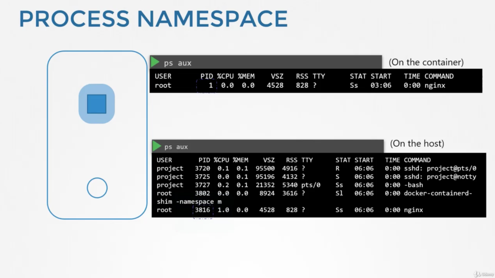
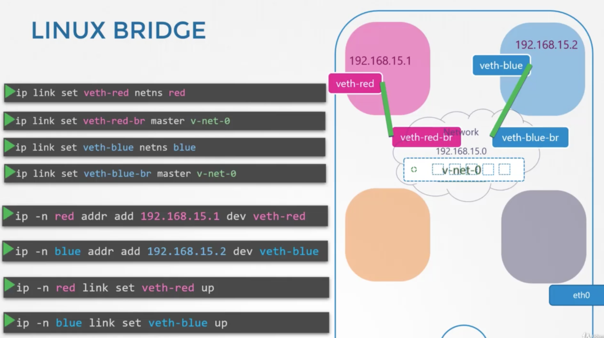

### Namespace란?
- 도커 같은 컨테이너에서 network isolation을 구현하기 위해서 사용되는 개념
- host가 집이라면 namespace는 방이다.
- 각 namespace 내부에서는 같은 namespace에 속한 것들만 볼 수 있다.
- 컨테이너 만드는 시점에서는 네임 스페이스로 감싸주어서 분리 시킨다.

- 즉, 컨테이너 내부에서 프로세스를 실행하면 자신의 프로세스 하나만 보이지만, 호스트 입장에서 보면 다른 수많은 프로세스들 가운데 하나이다. 보는 관점에 따라서 해당 프로세스의 PID가 달리진다.

### Network Namespace란
- 호스트는 자체 라우팅 테이블과 ARP 테이블을 가지고 외부 네트워크와 통신한다.
- 호스트에 속한 컨테이너의 입장에서는 이를 볼 수 없다. 대신 이 역시 자체적인 라우팅 테이블을 가지고 외부 네트워크와 통신한다.

### Create Network Namespace
```bash
$ ip netns add red 
$ ip netns add blue 
$ ip link // 인터페이스 목록 조회하기, 초기 네임 스페이스에서는 아무것도 조회되지 않는다.
$ ip netns exec red ip link 
or
$ ip -n red link
// ip link 명령어를 red라는 namespace 내부에서 실행하는 효과를 낸다.
``` 
```bash
// namespace간 연결하기
// veth: 가상 회선, 가상 인터페이스
$ ip link add veth-red type veth peer name veth-blue 
$ ip link set veth-red netns red
$ ip link set veth-blue netns blue
$ ip -n red addr add 192.168.15.1 dev veth-red
$ ip -n blue addr add 192.168.15.2 dev veth-blue
$ ip -n red link set veth-red up
$ ip -n blue link set veth-blue up
```
1. veth를 생성한다.
2. 생성한 veth를 각각의 네임스페이스에 붙여준다.
3. ip addr 명령어를 사용하여 ip 주소를 부여해준다.
이렇게 두 네임 스페이스를 연결해주면 각각의 route table과 ARP table에 서로의 네트워크 정보가 담기게 된다.

### 여러 네임 스페이스 연결하기 
- 여러 옵션들이 있지만 LINUX BRIDGE를 사용
- veth와 veth-bridge를 만들고, 내부의 브릿지에 연결해주는 방식

```bash
// 브릿지를 만드는 명령어
$ ip link add v-net-0 type bridge
$ ip link set dev v-net-0 up
```
- 브릿지를 만든다.
- 가상 회선을 만들어서 브릿지와 네임 스페이스를 연결해준다.
```bash
$ ip link add veth-red type veth peer name veth-red-br
$ ip link add veth-blue type veth peer name veth-blue-br 
$ ip link set veth-red netns red
$ ip link set veth-red-br master v-net-0
$ ip link set veth-blue netns blue
$ ip link set veth-blue-br master v-net-0
$ ip -n red addr add 192.168.15.1 dev veth-red
$ ip -n blue addr add 192.168.15.2 dev veth-blue
$ ip -n red link set veth-red up
$ ip -n blue link set veth-blue up
```
- 즉, 호스트 내부의 네임스페이스들 간에 네트워크를 연결해주기 위해서 브리지를 사용 가능하다.
- 브리지를 만들고, veth라는 가상 회선을 만들어서 브릿지와 네임 스페이스를 이어주면 된다.
- 이렇게 연결한 네트워크는 여전히 private하며 외부 네트워크와는 단절되어 있다.

### LAN과 네임스페이스 연결하기
- 로컬 호스트를 일종의 게이트웨이로 사용해서 외부 네트워크와 연결되어야 한다.
```bash
$ ip netns exec blue ip route add 192.168.1.0/24 via 192.168.15.5 
```
- 즉, 브릿지 가상회선과 로컬 호스트 인터페이스를 연결해주는 라우팅을 추가해주어야 된다.
```bash
$ iptables -t nat -A POSTROUTING -s 192.168.15.0/24 -j MASQUERADE 
```
