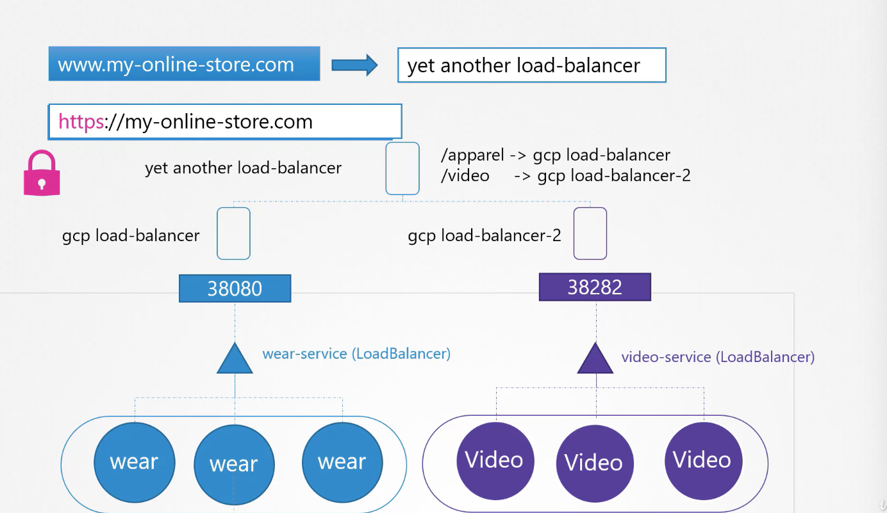

### Ingress
- service와 ingress는 무엇이 다른가?
- 도메인 이름도 넣고 싶고, 트래픽도 분산 시키고 싶고, 포트 매핑도 해주고 싶고, 라우팅도 분리시키고 싶고, ssl도 적용하고 싶다.

- 위와 같이 로드밸런서를 붙이고, 로드밸런서들을 다시 이어붙이는 수고를 쿠버네티스 클러스터 내부에서 설정 파일 하나만 가지고 하고 싶어서 만든게 인그레스

### Ingress Detail
- ingress controller를 배포하고 ingress resources를 설정해준다. (rules를 제공한다.)
- kubernetes는 ingress controller를 기본으로 제공해주지 않는다. 별도의 설치가 필요하다.
- ingress controller에는 여러가지 선택지가 있다.

### nginx ingress controller
- controller를 deployment로 배포한다.
- configmap으로 설정을 주입한다.
- 혹은 env로 필요한 환경 변수를 제공한다.
- 즉, Deployment, Service, Configmap, Auth를 Ingress Controller 구동으로 위해서 준비해야 한다.
- 그 다음 ingress resources를 작성해야하며 이는 kind: Ingress yaml로 작성이 가능하다.
