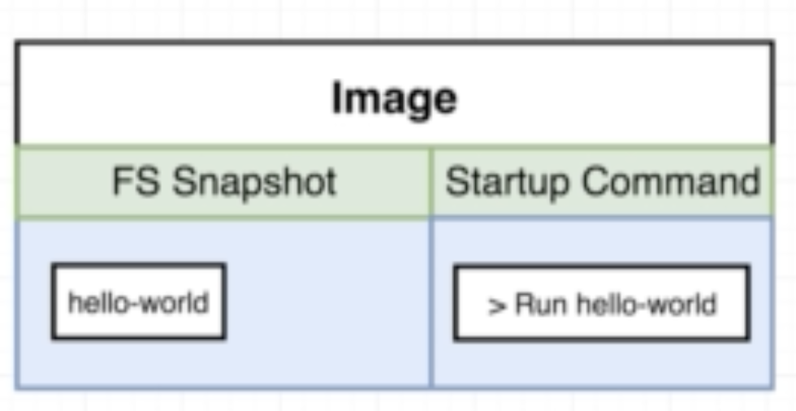

### docker run
```bash
$ docker run 'image name'
```
해당 명령어를 입력하면 파일 시스템 스냅샷에 있는 이미지를 컨테이너 안의 파일 시스템에 복사해주고, 프로세스를 동작시킨다. 

### overriding default commands
```bash
$ docker run 'image name' commands(default command override) 
```
ex) docker run busybox echo hi there
echo hi there이 오버라이딩 부분이며 생성된 컨테이너 안에서 실행된다.
컨테이너를 실행하면 이미지의 파일 시스템 스탭샷이 컨테이너 안으로 복사되고
오버라이딩 된 명령어를 실행하게 된다.


### docker ps
현재 동작 중인 도커 프로세스의 목록을 보여준다.
```bash
$ docker ps --all (모든 컨테이너 프로세스 확인 가능)
```

### container lifecycle
docker run = docker create + docker start
```
$ docker create hello-world
> a799fbf59d25ec13c94a2d72b7655c753b2dabb216d3ca8dba80e5de87f51f7a
docker start -a a799fbf59d25ec13c94a2d72b7655c753b2dabb216d3ca8dba80e5de87f51f7a
> hello-world
docker start -a '컨테이너 id'에서 -a 역할: 해당 컨테이너에서 출력되는 stdout/stderr를 받아와서 출력해준다.
```
### restarting stopped containers
컨테이너 생성 시에 이미지의 파일 시스템 스냅샷을 복사해오고, startup command를 수행한다. 수행을 마치면 해당 컨테이너는 exited된다. 이 컨테이너를 다시 실행하면 startup command를 다시 실행하게 된다.

### Removing Stopped Containers
```
$ docker system prune
```
- all stopped container
- all networks not used by at least on container
- all dagling images
- all dangling build cache
전부 삭제. dangling image란 이름이 none인 이미지. 같은 이름의 새로운 버전의 이미지가 생성되었거나, 빌드 중간에 실패한 이미지들이 여기에 해당.

### Retrieving Log Outputs
컨테이너 안에서 출력된 모든 로그들을 확인할 수 있는 명령어

### Stopping Containers
```
$ docker stop
```
SIGTERM 메세지를 컨테이너에 보내준다.
```
$ docker kill
```
SIGKILL 메세지를 보내준다.
docker stop 메세지에 응답하지 않을시 docker kill을 사용 가능
docker stop이 10초간 응답하지 않으면 자동으로 docker kill을 수행한다.
처음부터 kill을 수행하면 곧바로 컨테이너를 종료한다.

### Multi-Command Containers
redis 컨테이너 안에서 redis cli도 함께 동작시키고 싶다.
start up command를 여러개 전달하고 싶다.

### The Purpose of the IT Flag
```
$ docker exec -it <container id> <command>
```
컨테이너 안에서 추가적인 명령어를 수행하고 싶을 떄 사용하는 명령어
-it 없이는 곧바로 리턴해버린다.

### -it Flag
리눅스에서 생성한 모든 프로세스는 세 가지 커뮤니케이션 체널을 갖는다. STDIN, STDOUT, STDERR가 그것이다.
STDIN: 프로세스 내부로 정보를 전달할 때 사용하는 체널
STDOUT: 프로세스 내부의 정보를 외부로 전달할 때 사용하는 체널
STDERR: 프로세스 내부의 에러를 외부로 알려줄 때 사용하는 체널
-i: 우리의 터미널을 command를 수행하는 프로세스의 stdin 체널에 연결시킨다.
-t: 입력하거나 출력하는 텍스트가 잘 포맷팅되어지게 하는 옵션
Allocate pseudo-TTY가 원래의 의미이며 더 깊이있는 내용은 아직 잘 이해가 안간다.

```
$ docker exec -i 9b708c461c0e redis-cli
-t 옵션 없이 실행이 되기는 하지만 텍스트가 제대로 출력되지 않는다. 그러므로 -it 옵션은 거의 붙여서 사용한다고 생각하면 된다.
```

### Getting a command prompt in a container
```
$ docker exec -it 9b708c461c0e sh
```
컨테이너 안에서 쉘 프로그램을 실행하는 명령어.
bash, powershell, zsh, sh 등이 쉘 프로그램이다.

### Container Isolation
컨테이너 간에는 파일 시스템을 공유하지 않는다. 

