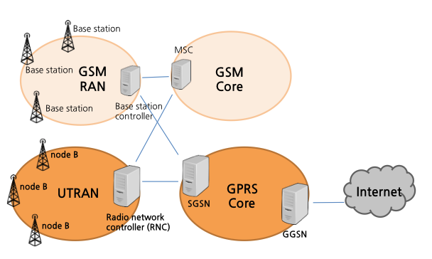
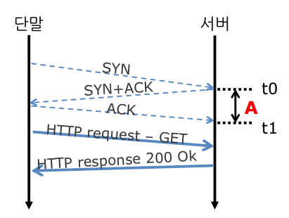
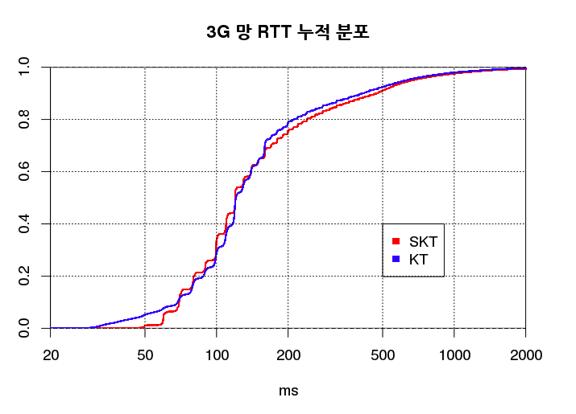

### 3G 모바일 네트워크의 이해
- 출처: https://d2.naver.com/helloworld/111111

### 3G 네트워크란?
- 3GPP(3rd Generation Partnership Project)라는 표준화 기구에서 제정한 UMTS(Universal Mobile Telecommunication System) 표준안을 따르는 네트워크를 의미
- LTE는 3.9G에 해당, 4G LTE는 LTE-A라고 한다.
- 한 세대에 하나의 표준안만 있는 것이 아님
  - 2G: GSM, CDMA, TDMA 방식 등이 있음
  - 3G: 비동기식인 W-CDMA, 동기식인 IMT-2000
  - 4G: WiBro(Wireless Broadband), LTE-Advanced 방식이 있음

### 3G 네트워크의 일반적인 구조

- GSM RAN(Radio Access Network): GSM Core 2G 음성 통화를 처리하는 네트워크
- UTRAN(UMTS Terrestrial Radio Access Network): 단말기와 기지국이 무선 전파 신호를 통해 교신하는 무선망 구간
- GPRS(General Packet Radio Service) Core, 코어망이라 부름. KT와 SKT가 소유한 유선네트워크 구간
- nodeB: 기지국 안테나
- Radio Network Controller (RNC): 안테나를 원격 조정하는 서버, 기지국의 두뇌
- GGSN(Gateway GPRS Support Node): 각 통신망 사업자의 사설 네트워크와 망을 중계하는 IPv4 공용 인터넷 관문 처리 장치

### 단말기 사설 IP 할당 구조
- 단말기에 할당되는 IP주소는 GGSN 내의 해당 통신사 네트워크에서만 유효한 사설 IP
- 공유기 역할을 하는 GGSN에는 단말기에 부여된 사설 IP와 공용 네트워크에서 사용할 공인 IP를 매칭하는 주소 변환 테이블이 있고, 여기서 사설 IP는 공인 IP로 변환된다.
- 즉, GGSN이라는 거대한 공유기가 핸드폰 단말기에 사설 IP를 부여해주는 것이다.
- 이 구조에서 문제점은 단말기가 먼저 서버에 접속하기 전에는 서버에서 단말기에 접속할 수 없다는 것이다. 때문에 단말기 입장에서는 어떻게 해서든 서버와의 연결을 유지해야한다.

### 애플리케이션에서 연결 상태 확인
- 모바일 네트워크 상에서는 단말기에서 소켓 API를 호출하는 방법으로 정상적인 연결 여부를 확인할 수 없다.
- 단말기 이동으로 인해 네트워크 연결 정보가 변경되더라도 단말기에 부여된 IP 주소나 열려있는 TCP/UDP 소켓을 초기화하지 않고 계속 유지하려 한다.
- 덕분에 애플리케이션 개발자는 IP 이동성을 고려하지 않고 유선 네트워크와 동일한 방식으로 애플리케이션 개발이 가능하다.
- 단말기의 이동이나 무선 전파 지원사정에 따라서 PPP/GTP-U(GPRS Core Network-U) 터널이나 AAL 가상 서킷의 상태가 시시각각 변경되고, 이로 인한 문제가 PPP 레이어까지 전달되지 않는 경우가 많다.
- 네트워크 연결은 운영체제가 관장하고 있기 때문에 연결을 맺은 후에 PPP에서 오류를 전달하지 않는다면 운영체제와 애플리케이션은 정상적인 소켓 연결 상태라고 판단할 수 밖에 없다.
- 연결된 상태로 간주하고 계속해서 패킷 전송 시도, ACK를 받을 수 없으니 재전송을 요청, 연결이 되면 그제서야 패킷 전송 완료

### 3G 네트워크 속도
- 네트워크의 속도는 대역폭과 지연 시간을 기준으로 접근
- 3G는 업로드와 다운로드 대역폭이 다른 비대칭 네트워크
- 3G: 다운로드는 1.9~2.0Mbps, 업로드는 0.8~0.9Mbps
- 대역폭: 용량이 큰 데이터를 내려받는 시간에 영향을 미침
- 지연 시간: 용량이 작은 데이터의 경우엔 지연 시간이 체감 속도에 더 큰 영향
  TCP 세션이 회선 대역폭을 한계까지 활용하지 못하고 세션이 끝나버리기 때문
  때문에 메신저나 VoIP 같은 서비스의 품질은 대역폭보다 지연 시간에 더 많은 영향을 받게 된다.
  때문에 3G 네트워크 상에서 구동하는 애플리케이션의 속도를 향상시키려면 대역폭보다 지연시간에 관심을 가져야함

### 3G 네트워크 지연시간

- 단말기에서 SYN 패킷을 서버가 수신한 시간과 단말기로부터 ACK 패킷을 수신한 시간의 차이를 구하면 RTT를 계산할 수 있다.

- 3G 네트워크의 전형적인 RTT는 100~200ms 정도
- 당시의 국내 유선망의 RTT는 20ms 이하로 무선망보다 10배 더 빠른 수준
- 가뜩이나 느린데 로그 수집을 위해서 HTTP redirect를 수행할 경우 한번 웹 페이지를 전송하는데 1초 가량이 걸리게 됨

### 3G 네트워크의 통신모드 전환 지연
- 일정시간동안 인터넷과 연결되지 않은 상태로 있다가 인터넷에 연결했을 때 발생하는 2~3초의 지연
- 여러 단말기가 무선 주파수를 공유하기 때문에 주파수 자원을 최대한 아껴쓰도록 프로토콜이 동작
- 필요할 때만 무선 통신침을 가동, 그 외엔 잠자기 모드
- 무선 통신이 해제된 상태에서 다시 데이터 통신이 필요하면 단말기는 통신사의 RNC와 시그널 메세지를 주고 받아 통신사 내부 네트워크에 연결을 시도. 이 시그널 메세지가 오고 가는데 약 2~3초의 지연 발생

### TCP 세그맨테이션 및 혼잡 윈도우와의 관계
- TCP는 데이터를 여러 패킷으로 나눠 송출하며 데이터를 나누는 단위를 MSS(maximum segment size)라 부른다.
- 이더넷 네트워크 -> MSS가 1460바이트 패킷 두개와 80ㅍ바이트 패킷 한개로 나눠 전송
- SKT는 1380바이트, KT는 1410바이트를 주로 사용
- TCP는 혼잡 윈도우라는 방법으로 한번에 여러 패킷을 전송할 수 있도록 고안됨
- 최초로 TCP 연결이 발생하면 패킷 2개 전송, ACK 수신하면 그 다음 4개 전송하는 식으로 패킷 전송량을 늘려감
- 이러다가 회선 대역폭을 꽉 채우면 RTO(Retransmission TimeOut)이 발생, 혼잡 윈도우가 늘었다 줄었다 하면서 최대 대역폭에 가까운 성능을 유지

### 음영지역과 TCP
- 기본적으로 TCP는 보낸 패킷에 대한 ACK 도착 여부로 네트워크 상태 파악
- ACK가 도착하지 않으면 보낸 패킷이 유실되었거나 네트워크가 아주 느리다고 판단
- 그러면 고속 전송을 포기, 네트워크가 정상으로 돌아올 때까지 패킷을 천천히 조금씩 재전송
- 모바일 환경에서는 음영지역(통신상태불량)을 고려해야함
- 음영지역에서는 네트워크 사오항이 급변. TCP는 ACK 패킷 도착 여부로만 통신상태를 파악. 
