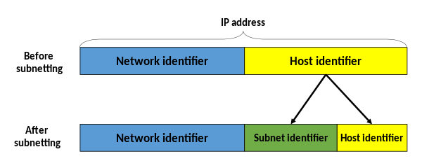

### NAT(networ address translation)
IP 패킷의 TCP/UDP 포트 숫자와 목적지의 IP 주소 등을 재기록 하면서 라우터를 통해 네트워크 트래픽을 주고 받는 기술을 의미. 사설 네트워크에 속한 여러개의 호스트가 하나의 공인 IP 주소를 사용하여 인터넷에 접속하기 위함. IPv4 주소 부족을 해결하기 위한 시도 가운데 하나

### 가상 머신에서 NAT을 쓴다는 의미는?
스위치 대신 NAT 라우터가 VM과 실제 네트워크 연결 사이에 있다는 것. 호스트 컴퓨터가 라우터 처럼 작동. 
VM이 주고 받는 모든 패킷이 호스트 컴퓨터를 통해서 라우팅 된다.

### 가상 머신에서 어뎁터에 브리지가 의미한느 것은?
가상 스위치가 VM과 실제 네트워크 연결 간에 연결되는 것. 더 낮은 수준에서 호스트를 통해 네트워크로 연결된다. 

### 브리지란?
여러 네트워크 장비들을 

### 서브넷
IP 네트워크의 논리적인 부분 집합을 서브넷이라 부른다. 네트워크를 둘 이상으로 나누는 작업을 서브네팅이라 부른다.

IP 주소: 11000000.10101000.00000101.10000010	     192.168.5.130
서브넷 마스크: 11111111.11111111.11111111.00000000	   255.255.255.0
네트워크 접두사: 11000000.10101000.00000101.00000000	192.168.5.0
호스트 부분: 00000000.00000000.00000000.10000010       0.0.0.130

호스트 부분으로 부터 일부 상위 비트를 지정하고 서브넷 마스크 형성을 위해 네트워크 마스크 안에 이들을 묶는 과정이다.
이를 통해 하나의 네트워크를 더 조그마한 서브넷으로 나눈다. 

IP 주소	11000000.10101000.00000101.10000010	192.168.5.130
서브넷 마스크	11111111.11111111.11111111.11000000	255.255.255.192
네트워크 접두사	11000000.10101000.00000101.10000000	192.168.5.128
호스트 부분	00000000.00000000.00000000.00000010	0.0.0.2

### 가상머신에서 NAT과 브리지의 차이
NAT 사용시 가상 머신의 IP와 호스트가 연결하는 네트워크가 분리됨.

### OSI 7 계층 모형
1. 물리 계층(Physical)
네트워크의 기본 네트워크 하드웨어 전송 기술을 이룸.
2. 데이터 링크 계층(Data Link)
포인트 투 포인트 간 신뢰성 있는 전송을 보장하기 위한 계층. 개체들 간 데이터를 전달.
이더넷이 가장 대표적인 예시.
3. 네트워크 계층(Network)
여러개의 노드를 거칠때마다 경로를 찾아주는 역할을 하는 계층으로 다양한 길이의 데이터를 네트워크들을 통해 전달하고 그 과정에서 전송 계층이 요구하는 서비스 품질을 제공하기 위한 기능적 절차적 수단을 제공. 라우팅, 흐름제어, 세그멘테이션, 오류 제어, 인터네트워킹 등을 수행. 라우터가 이 계층에서 동작. 인터넷이 가능하게 만드는 계층. 
4. 전송 계층(Transport)
양 끝단의 사용자들이 신뢰성있는 데이터 를 주고 받을 수 있도록 해주어 상위 계층들이 데이터 전달의 유효성이나 효율성을 생각하지 않도록 해준다. 시퀀스 넘버기반의 오류 제어 방식을 사용. TCP가 가장 대표적인 사례
5. 세션 계층(Session)
양 끝단의 응용 프로세스가 통신을 관리하기 위한 방법을 제공한다. TCP/IP 세션을 만들고 없애는 책임을 진다. 
6. 표현 계층(Presentation)
코드 간 번역을 담당. MIME 인코딩이나 암호화 등의 동작이 이 계층에서 이루어진다.
7. 응용 계층(Application)
응용 프로세스와 직접 관계하여 일반적인 응용 서비스를 수행한다. HTTP, SMTP 등이 사례이다.

### 이더넷
LAN, MAN, WAN에서 가장 많이 활용되는 기술 규격. OSI 모델의 물리 계층에서 신호와 배선, 데이터 링크 계층에서 MAC 패킷과 프로토콜의 형식을 정의.
하나의 인터넷 회선에 유무선 통신장비 공유기, 허브 등을 통해 다수의 시스템이 랜선 및 통신 포트에 연결되어 통신이 가능한 네트워크 구조

### 인터넷
컴퓨터로 연결하여 TCP/IP라는 통신 프로토콜을 이용해 정보를 주고 받는 컴퓨터 네트워크.
네트워크 계층으로 IP를 사용하고, 전송 계층으로 TCP를 사용하는 컴퓨터 네트워크

### IP주소란
 컴퓨터 네트워크에서 장치들이 서로를 인식하고 통신을 하기 위해서 사용하는 특수한 번호.

### IPv4 / IPv6
32비트 (0~255) 사이 십진수 네개를 사용. 42억개 가량이 존재. IPv6는 주소 길이를 128비트로 늘림. 16진수 8개를 사용.

### IP(Internet Protocol)
송신 호스트와 수신 호스트가 패킷 교환 네트워크에서 정보를 주고 받는데 사용하는 정보 위주의 규약이며, OSI 네트워크 계층에서 호스트의 주소 지정과 패킷 분할 및 조립 기능을 담당한다. IP 정보는 패킷 혹은 데이터 그램이라는 단위로 나뉜다.

### LAN
local area network. 학교나 연구실, 대학 등 제한된 지역 내에서 컴퓨터들을 연결하는 네트워크. 이더넷이나 와이파이가 대표적인 사례이다.

### WAN

### 스위치
소규모 통신을 위한 허브보다 전송 속도가 개선된 것

### 허브
이더넷 네트워크에서 여러 대의 컴퓨터, 네트워크 장비를 연결하는 장치. 한 대의 허브를 중심으로 여러대의 컴퓨터와 네트워크 장비가 마치 별 모양으로 연결되며 같은 허브에 연결된 컴퓨터와 네트워크 장비는 모두 상호간에 통신할 수 있게 된다. 허브는 스위치 등의 장비에 연결되며 더 높은 계층의 네트워크와의 연결이 가능해진다.
