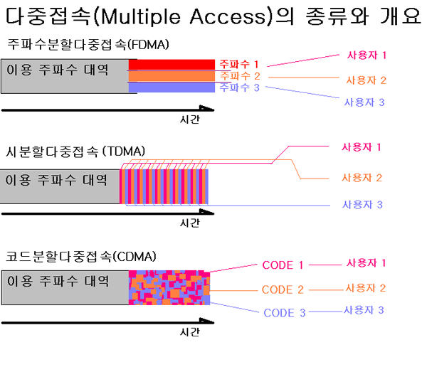

## cdma2000/EV-DO
### CDMA 개요
- 1992년 미국 퀄컴이 CDMA 무선 접속 방식을 이용하여 이동통신에 성공하며 시작
- 한국에서 최초 상용화
- CDMA는 기존 셀룰러 방식과 결합하여 주파수 이용의 효율을 극대화하는 개념

### CDMA 기본 개념
- 전파는 간섭 특성을 지녀서 인접 기지국 간에 동일한 주파수를 사용하지 못하였다.
- 때문에 주파수 재사용율이라는 개념을 두고, 기지국 간에 거리를 두게 하였다.
- 하지만 CDMA 기술을 통해서 주파수 재사용율을 1로 만들고, 인접 기지국 간에도 동일 주파수 사용이 가능해졌다.
- 주파수와 시간을 사용자마다 임의로 다르게 하는 확산 코드를 이용하여 간섭을 최소화 시킴으로써 가능
- 기지국들이 모두 동일한 주파수를 사용해도 되므로 각 기지국들이 사용할 수 있는 대역폭이 늘어나 수용 가능 가입자 수가 증가함

### CDMA의 원리
- 원래는 군사적 목적으로 개발된 무선 통신 기술
- 전송하고자 하는 신호에 변조를 가한 뒤, 확산 코드와 XOR 연산을 통해서 신호를 확산시킨다.
- 확산된 신호를 전달하고, 이 확산 코드를 모르는 수신자는 설령 도청을 하더라도 복조를 할 수 없다.
- 수신자는 확산 코드를 이용해 신호를 복조함으로써 안전하게 신호 수신이 가능하다.
- 이를 이해가 쉽게 그림으로 표현하면 아래와 같다.

- 전달하고자 하는 digital 신호에 임의로 생성한 random code를 XOR 연산 방식으로 곱해준다.
- random code를 생성하는 방식에도 여러 종류가 있다.
- random code를 모르는 상대방에겐 해당 신호가 그저 잡음처럼 들린다.
- 그 결과로 마치 잡음이 가득한 식당 내에서도 모국어는 잘들리는 것 처럼 동일한 주파수를 사용하더라도 사용자마다 다른 랜덤 코드를 부여해서 간섭을 최소화 하고 동시 접속이 가능하게끔 한다.

- 다른 다중 접속 방식과 비교하면 CDMA는 사용자별로 주파수를 구분하지고, 시간대를 구분하지도 않는다.
- 이를 통해서 주파수 재사용율을 1로 만들고, 동시 접속 가능한 사용자 수를 대폭 확대하였다.

### CDMA 시스템의 특징
1. 주파수 재사용 및 망설계
- 주파수 재사용율이 1, 효율적, 구조가 단순
2. 소프트 핸드오프
- 두 기지국의 주파수가 동일하여 두 기지국에 동시에 접속하는 소프트 핸드오프, 두 개의 섹터 기지국에 동시에 접속하는 소프터 핸드오프를 이용하여 핸드오프시 중단 현상이 없다.
3. 정밀한 전력 제어
- 여러 단말기가 동일한 주파수를 사용하기 때문에 상호 간섭을 최소화하려면 정밀한 전력 제어가 필요하다.
4. 통화 비밀 보호
5. 그 밖에도 여러 특징들이 있으나 생략

### cdma2000 망구조
- 음성 서비스와 패킷 서비스 망이 BSC 단에서 구분되어 있음
- 이후 All-IP 망을 기반으로 음성, 영상, 데이터 모두 패킷망으로 서비스
