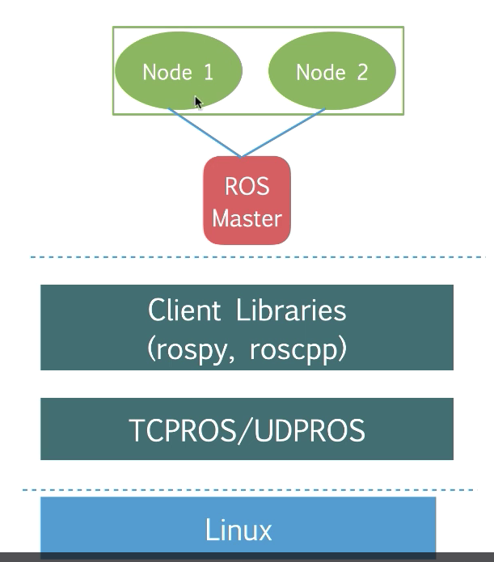
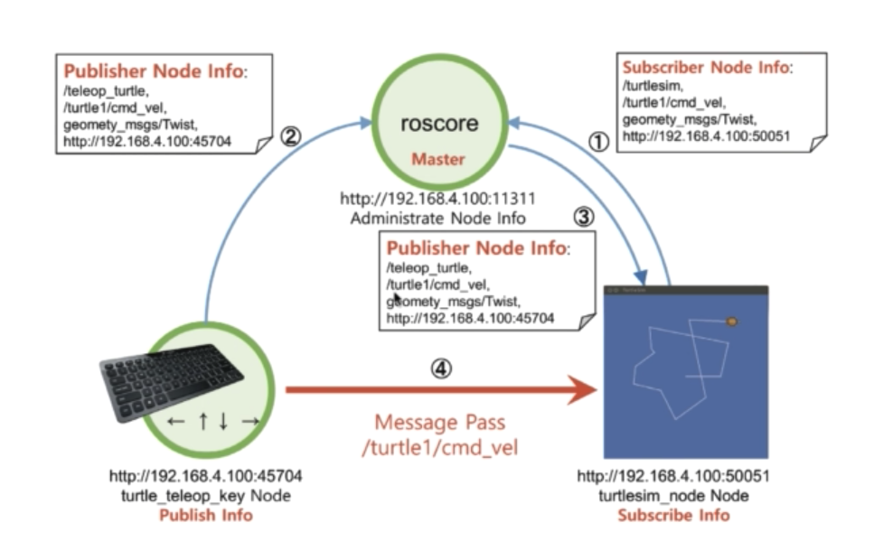
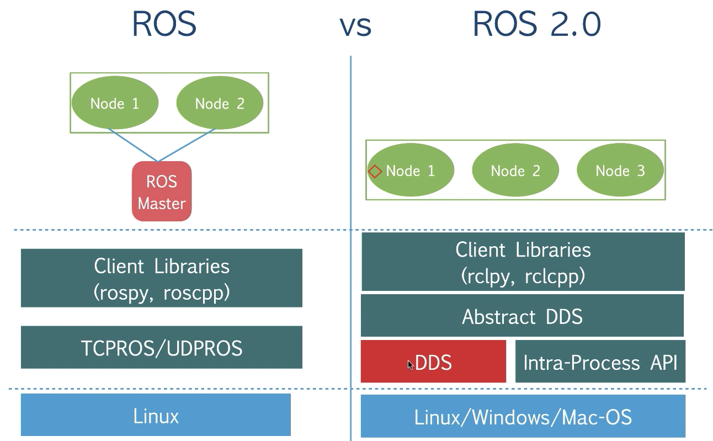

## ROS architecture

- 노드는 사실 컴퓨터 안에서 돌고 있는 프로세스이다.
- 노드들은 ros master와 연결되어 서로 통신하게 된다.
- 파이썬과 c++을 기본 클라이언트 라이브러리로 지원한다.
- 통신은 TCP/UDP를 지원한다.
- 운영체제는 리눅스를 기반으로 한다.

## Ros Concept

- 먼저 로봇 노드가 마스터를 subscribe한다. 마스터는 roscore로 표현된다.
- 사용자는 입출력기를 통해 마스터에 자신을 등록한다.
- 마스터는 이를 노드에 이 정보를 전달한다.
- 이제 사용자가 로봇에 직접 접속하여 명령을 날릴 수 있게 된다.

## Ros Communication Paradigm
### Pub/Sub
- 하드웨어는 데이터를 수집해서 전송하고(Publish), Subscriber가 땡겨오는 방식으로 통신한다.

### Ros Service
- 동기 / 블로킹 방식으로 동작하는 통신방법

### ActionLib
- Ros에서 통신은 논블로킹으로 이루어진다. 클라이언트가 요청을 날리면 모두 수행한 뒤, 응답을 준다.

## ROS path palanning and Navigation
### Path Planning
- ROS의 가장 큰 장점은 navigation을 쉽게 만들어주었다는 것이다.
- map을 만들고, 주행하고, 장애물을 피해가는 등의 동작이 가능하다.
- Global Path Planner: 출발 지점부터 도착 지점까지의 경로를 결정, 에이스타, 다익스트라
- Local Path Planner: 

## Limitation of ROS
- desinged for single robot
- not real time
- need reliable network, 많은 노드가 서로 서로 통신해야하므로 네트워크가 뒷받침 되어야 한다.
- single point of failure

## ROS2

- 기존 노드-마스터 구조에서 노드간 통신 구조로 변경
- 리눅스, 윈도우, 맥 크로스 플랫폼 지원
- 멀티 로봇, 리얼타임, 빠른 개발 지원
- TCP나 UDP를 쓰는 대신 대안으로 DDS를 쓰게됨
- DDS를 통해서 scalability, flexibility, real time performance, quality of service를 달성

## DDS
- Data Distribution Service
- 주식 거래, 항공 교통 제어, 스마트 그리드, 빅데이터 등에 사용
- DDS는 기존 ROS와 유사하게 동작, 이를 활용하여 ROS master가 해주던 역할을 대체함으로써 ROS2를 개발
- DDS는 여러 구현체가 있으며, ROS2에선 어느 벤더에서 나왔는지와 상관없이 사용이 가능
