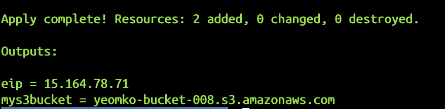

### Attribue
- 결과로 출력된 attribute는 사용자가 reference 하는데 사용될 뿌만 아니라 다른 테라폼에 의해 생성되는 리소스들에 의해서 사용되어 질 수 있다.
- 예를들어 테라폼에 의해 생성된 인스턴스의 ip 값을 자동으로 방화벽의 whitelist에 추가할 수 있다.

### 리소스 생성한 후에 결정되는 속성 값 읽어오기
```
resource "aws_s3_bucket" "mys3" {
  bucket = "yeomko-bucket-007"
}

output "mys3bucket" {
  value = aws_s3_bucket.mys3.bucket_domain_name
}
```
- output에 변수명과 value 다음 리소스명.속성명을 지정해주어서 값을 읽어올 수 있다.
- terraform apply를 해주면 아래처럼 콘솔창에서 output 결과 값을 확인할 수 있다.


### Referencing Cross Resource Attribute
```
resource "aws_instance" "myec2" {
  ami = "ami-05a4cce8936a89f06"
  instance_type = "t2.micro"
}

resource "aws_eip" "lb" {
  vpc = true
}

resource "aws_eip_association" "eip_assoc" {
  instance_id   = aws_instance.myec2.id
  allocation_id = aws_eip.lb.id
}
```
- 리소스 간의 연결을 담당하는 리소스를 이용해서 자동으로 eip를 ec2 인스턴스에 할당하였다.

```
resource "aws_security_group" "allow_tls" {
  name        = "kplabs-security-group"
  ingress {
    from_port   = 443
    to_port     = 443
    protocol    = "tcp"
    cidr_blocks = ["${aws_eip.lb.public_ip}/32"]
  }
}
```
- js 스타일의 문자열 포맷팅 사용이 가능하다.
- CIDR block을 지정해 줄 때에는 /32와 같이 subnet bit를 지정해주어야 한다.

### Terraform Variables
- 고정 값을 할당하지 말고 변수를 만들어서 할당하라.
- 고정 값을 할당할 경우, 만약 ip가 변경되는 등의 상황에 일일이 코드를 수정해주어야 하는 불편함이 있다.
- 별도의 variable.tf 파일을 만들어주고, 변수 값을 모아준다.

### Terraform Variable 할당 방법
- variables.tf 파일을 만들고 여기에 default 값을 설정
- 콘솔에서 직접 입력해서 설정
- 프러덕션 환경에서는 variables.tf 파일에 필요한 변수들을 다 적어주고 기본값들은 terraform.tfvars 파일에 모아준다.
